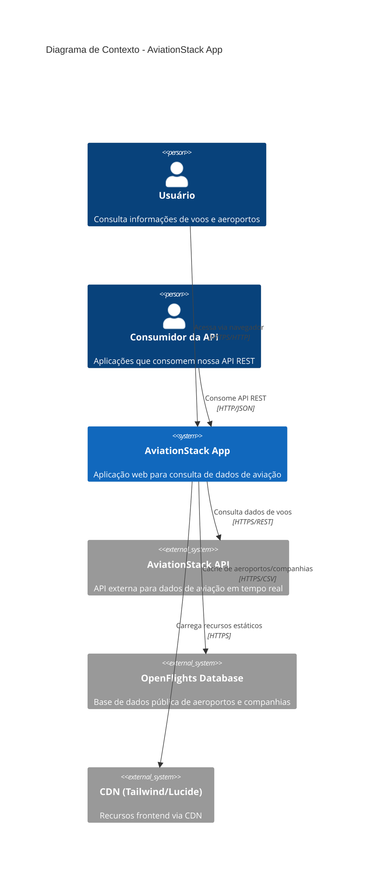
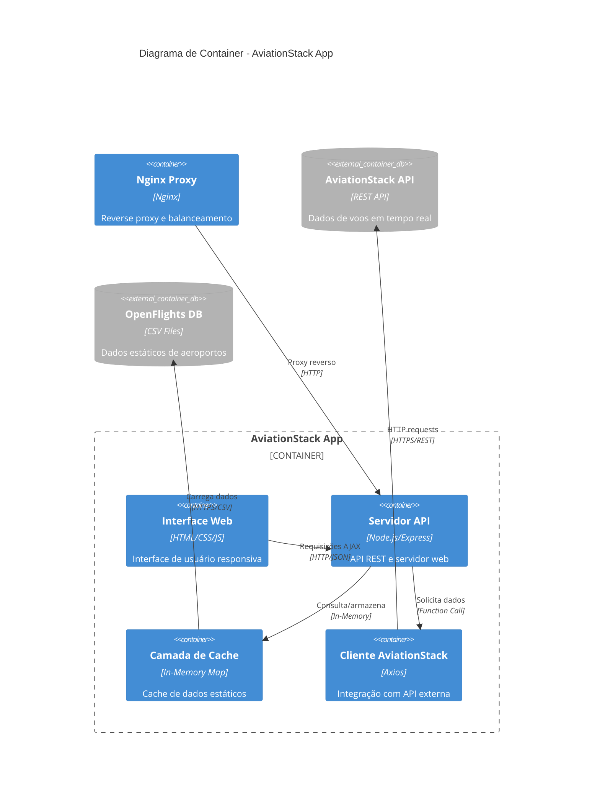
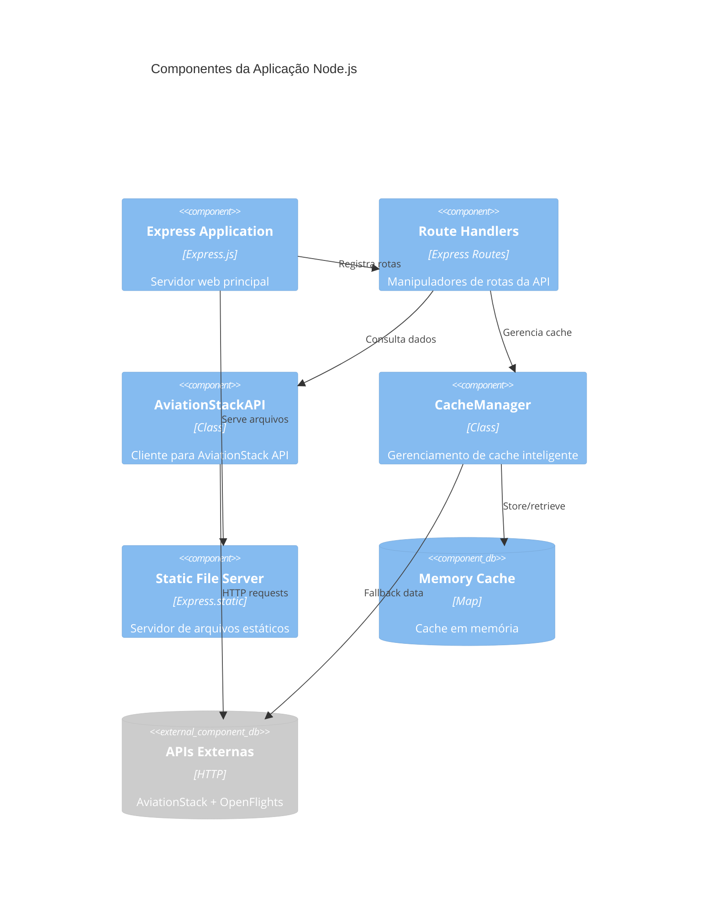
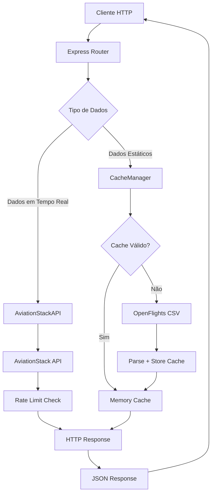
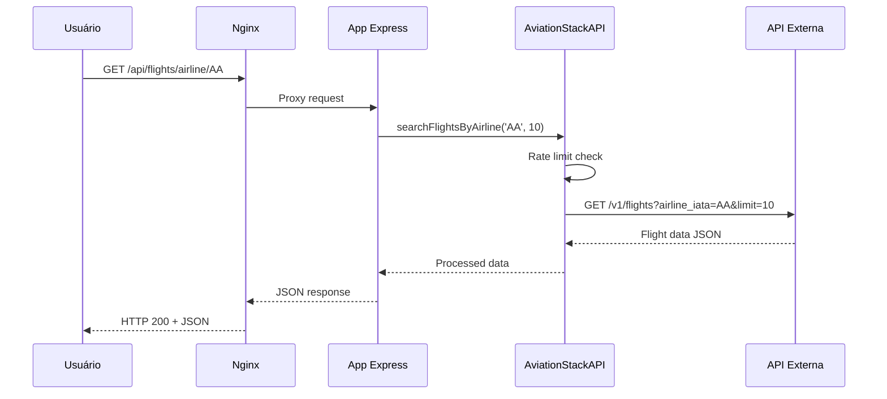
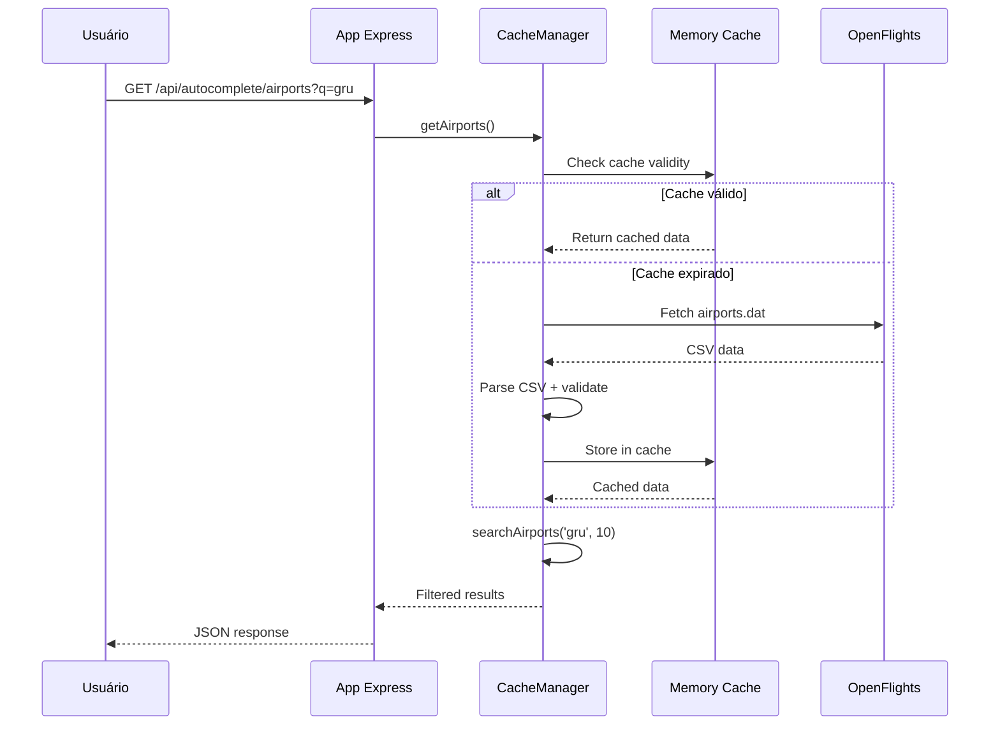
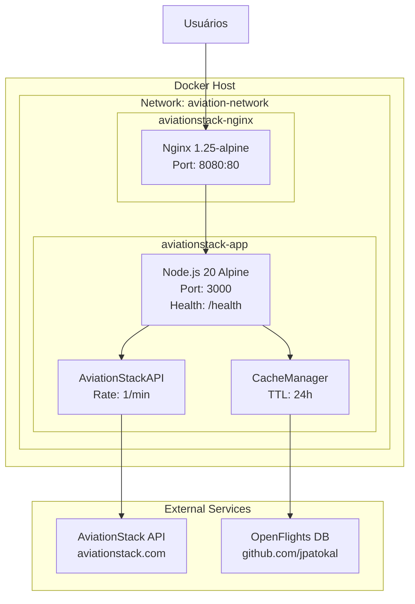

# Documentação de Arquitetura - AviationStack App

## 📋 Índice

- [Visão Geral](#visão-geral)
- [Contexto do Sistema](#contexto-do-sistema)
- [Arquitetura de Container](#arquitetura-de-container)
- [Componentes e Módulos](#componentes-e-módulos)
- [Arquitetura de Dados](#arquitetura-de-dados)
- [Decisões Arquiteturais (ADRs)](#decisões-arquiteturais-adrs)
- [Diagramas](#diagramas)

## 🎯 Visão Geral

A AviationStack App é uma aplicação web Node.js que fornece uma interface para consulta de dados de aviação em tempo real através da API da AviationStack. O sistema foi projetado para ser simples, eficiente e facilmente implantável em diferentes ambientes.

### Características Principais

- **Simplicidade**: Arquitetura monolítica simples com separação clara de responsabilidades
- **Performance**: Cache inteligente com fallback e compressão de dados
- **Escalabilidade**: Containerização com Docker e orquestração via Docker Compose
- **Resiliência**: Health checks, restart automático e gerenciamento de rate limiting
- **Usabilidade**: Interface web moderna e API REST bem documentada

### Stack Tecnológico

| Componente | Tecnologia | Versão | Propósito |
|------------|------------|--------|-----------|
| **Runtime** | Node.js | 20 LTS | Execução da aplicação |
| **Framework Web** | Express.js | 4.18.2 | Servidor HTTP e API REST |
| **Cliente HTTP** | Axios | 1.11.0 | Requisições para APIs externas |
| **Cache** | In-Memory Map | Nativo | Cache de dados estáticos |
| **Containerização** | Docker | Multi-stage | Isolamento e deployment |
| **Proxy** | Nginx | 1.25-alpine | Reverse proxy e load balancing |
| **Frontend** | Vanilla JS + Tailwind | CDN | Interface de usuário |

## 🌍 Contexto do Sistema



### Stakeholders

| Stakeholder | Interesse | Responsabilidades |
|-------------|-----------|-------------------|
| **Usuários Finais** | Consultar informações de voos de forma rápida e confiável | Fornecer feedback de usabilidade |
| **Desenvolvedores** | Manter e evoluir o sistema | Implementar funcionalidades e correções |
| **Operações/DevOps** | Garantir disponibilidade e performance | Monitoramento e deployment |
| **AviationStack** | Provedor de dados | Fornecer API confiável com SLA |

### Requisitos Não-Funcionais

| Atributo | Requisito | Implementação |
|----------|-----------|---------------|
| **Performance** | < 2s tempo de resposta | Cache local, compressão gzip |
| **Disponibilidade** | 99% uptime | Health checks, restart automático |
| **Escalabilidade** | Suporte a múltiplas instâncias | Containerização, proxy Nginx |
| **Segurança** | Proteção de API keys | Variáveis de ambiente, usuário não-root |
| **Usabilidade** | Interface responsiva | Design mobile-first |

## 🐳 Arquitetura de Container



### Estrutura de Deployment

```yaml
# docker-compose.yml - Estrutura de serviços
aviationstack-app:        # Container principal da aplicação
  ├── Node.js 20 Alpine    # Runtime otimizado
  ├── Express.js           # Framework web
  ├── Cache Manager        # Gerenciamento de cache
  └── Health Check         # Monitoramento de saúde

aviationstack-nginx:       # Proxy reverso
  ├── Nginx 1.25 Alpine    # Servidor web
  ├── Configuração custom  # Otimizações de performance
  └── Health Check         # Monitoramento de proxy

Networks:
  aviation-network:        # Rede interna isolada
    ├── Subnet: 172.20.0.0/16
    └── Driver: bridge
```

## 🧩 Componentes e Módulos



### Estrutura de Módulos

```
📁 teste-app/
├── 📄 index.js                 # Servidor principal (Express app)
├── 📄 aviationstack.js         # Cliente AviationStack API
├── 📄 cache-manager.js         # Gerenciamento de cache
├── 📄 build.js                 # Script de build para produção
├── 🐳 Dockerfile               # Multi-stage container build
├── 🐳 docker-compose.yml       # Orquestração de serviços
├── 📁 public/                  # Arquivos estáticos (desenvolvimento)
│   ├── 📄 index.html           # Interface principal
│   ├── 📁 css/styles.css       # Estilos customizados
│   └── 📁 js/
│       ├── 📄 app.js           # Lógica principal frontend
│       └── 📄 autocomplete.js  # Funcionalidade de autocomplete
├── 📁 dist/                    # Build otimizado (produção)
├── 📁 nginx/                   # Configuração do proxy
│   └── 📄 nginx.conf           # Config Nginx
└── 📄 k8s-deployment.yaml      # Deployment Kubernetes
```

### Responsabilidades dos Componentes

#### 1. Express Application (index.js:1-205)
- **Responsabilidade**: Orchestração geral da aplicação
- **Funcionalidades**:
  - Inicialização do servidor HTTP
  - Configuração de middlewares (compressão, JSON parsing)
  - Roteamento de requisições
  - Servir arquivos estáticos
  - Health check endpoint

#### 2. AviationStackAPI (aviationstack.js:6-116)
- **Responsabilidade**: Integração com API externa
- **Funcionalidades**:
  - Rate limiting automático (1 req/min)
  - Tratamento de erros da API
  - Métodos especializados para diferentes endpoints
  - Logging detalhado de requisições

#### 3. CacheManager (cache-manager.js:3-241)
- **Responsabilidade**: Otimização de performance via cache
- **Funcionalidades**:
  - Cache TTL de 24 horas
  - Fallback para OpenFlights database
  - Busca e autocomplete em dados cached
  - Parser CSV robusto para dados OpenFlights

## 📊 Arquitetura de Dados

### Fluxo de Dados



### Estruturas de Dados

#### Aeroportos
```javascript
{
  iata_code: "GRU",           // Código IATA (3 chars)
  icao_code: "SBGR",          // Código ICAO (4 chars)
  airport_name: "Guarulhos...", // Nome completo
  city_name: "São Paulo",     // Cidade
  country_name: "Brazil",     // País
  timezone: "America/Sao_Paulo", // Fuso horário
  latitude: -23.432075,       // Coordenada geográfica
  longitude: -46.469511       // Coordenada geográfica
}
```

#### Companhias Aéreas
```javascript
{
  iata_code: "G3",           // Código IATA (2-3 chars)
  icao_code: "GLO",          // Código ICAO (3 chars)
  airline_name: "GOL",       // Nome da companhia
  country_name: "Brazil",    // País de origem
  callsign: "GOL"           // Callsign para comunicação
}
```

#### Voos (AviationStack API)
```javascript
{
  flight_date: "2024-01-15",
  flight_status: "active",
  departure: {
    airport: "GRU",
    timezone: "America/Sao_Paulo",
    iata: "GRU",
    scheduled: "2024-01-15T10:30:00+00:00"
  },
  arrival: {
    airport: "JFK", 
    timezone: "America/New_York",
    iata: "JFK",
    scheduled: "2024-01-15T18:45:00+00:00"
  },
  airline: { name: "American Airlines", iata: "AA" },
  flight: { number: "245", iata: "AA245" }
}
```

### Estratégias de Cache

| Tipo de Dados | TTL | Source Primário | Fallback | Estratégia |
|----------------|-----|-----------------|----------|------------|
| **Aeroportos** | 24h | OpenFlights CSV | Lista estática | Eager loading |
| **Companhias** | 24h | OpenFlights CSV | Lista estática | Eager loading |
| **Voos** | - | AviationStack API | Erro HTTP | Rate limited |

## 🏗️ Decisões Arquiteturais (ADRs)

### ADR-001: Arquitetura Monolítica
**Status**: Aceito  
**Data**: 2024-01-15

**Contexto**: Decisão entre arquitetura monolítica vs microserviços.

**Decisão**: Implementar como aplicação monolítica Node.js.

**Razões**:
- Simplicidade de desenvolvimento e deployment
- Baixa complexidade operacional
- Adequado para o escopo do projeto
- Facilita debugging e monitoramento

**Consequências**:
- ✅ Desenvolvimento mais rápido
- ✅ Menos overhead operacional
- ⚠️ Escalabilidade limitada
- ⚠️ Acoplamento entre componentes

### ADR-002: Cache In-Memory com Fallback
**Status**: Aceito  
**Data**: 2024-01-15

**Contexto**: Necessidade de otimizar consultas a dados estáticos.

**Decisão**: Implementar cache em memória com fallback para OpenFlights.

**Razões**:
- Reduzir dependência da API paga
- Melhorar performance de autocomplete
- Dados de aeroportos/companhias são relativamente estáticos

**Consequências**:
- ✅ Performance melhorada
- ✅ Menor uso da API paga
- ⚠️ Uso de memória adicional
- ⚠️ Cache não persistente entre restarts

### ADR-003: Rate Limiting Automático
**Status**: Aceito  
**Data**: 2024-01-15

**Contexto**: AviationStack API gratuita tem limite de 1 req/min.

**Decisão**: Implementar rate limiting automático no cliente.

**Razões**:
- Evitar erros 429 (Too Many Requests)
- Garantir funcionamento contínuo
- Melhor experiência do usuário

**Consequências**:
- ✅ Funcionamento confiável
- ✅ Evita bloqueios da API
- ⚠️ Latência adicional em múltiplas consultas

### ADR-004: Multi-stage Docker Build
**Status**: Aceito  
**Data**: 2024-01-15

**Contexto**: Necessidade de otimizar imagem Docker para produção.

**Decisão**: Implementar build multi-estágio com separação dev/prod.

**Razões**:
- Reduzir tamanho da imagem final
- Separar dependências de desenvolvimento
- Otimizar para diferentes ambientes

**Consequências**:
- ✅ Imagens menores e mais seguras
- ✅ Builds mais eficientes
- ⚠️ Maior complexidade no Dockerfile

## 📈 Diagramas de Arquitetura

### Diagrama de Sequência - Consulta de Voos



### Diagrama de Sequência - Cache de Aeroportos



### Diagrama de Deployment



## 🔒 Considerações de Segurança

### Implementações de Segurança

1. **Proteção de Credenciais**
   - API keys via variáveis de ambiente
   - Arquivo .env não commitado
   - Exemplo .env.example para setup

2. **Container Security**
   - Usuário não-root (aviationapp:1001)
   - Imagem Alpine (surface de ataque reduzida)
   - Multi-stage build (sem ferramentas dev em produção)

3. **Network Security**
   - Rede Docker isolada (aviation-network)
   - Nginx como proxy (não exposição direta da aplicação)
   - Health checks para monitoramento

4. **Input Validation**
   - Validação de parâmetros de entrada
   - Sanitização de queries de busca
   - Tratamento robusto de erros

## 📊 Monitoramento e Observabilidade

### Health Checks

```javascript
// Endpoint de health check
GET /health
Response: {
  "status": "healthy",
  "timestamp": "2024-01-15T10:30:00.000Z",
  "uptime": 3600.123
}
```

### Logging Strategy

- **Console logging** com emojis para facilitar identificação
- **Request tracking** com URLs e parâmetros
- **Error handling** com stack traces em desenvolvimento
- **Rate limiting feedback** para debugging

### Métricas Disponíveis

| Métrica | Endpoint | Descrição |
|---------|----------|-----------|
| Saúde da aplicação | `/health` | Status, timestamp, uptime |
| Cache status | `/api/cache/preload` | Contadores de cache |
| Request logs | Console | Logs de requisições e respostas |

---

**Última atualização**: 2024-01-15  
**Versão da documentação**: 1.0.0  
**Responsável**: Equipe de Desenvolvimento