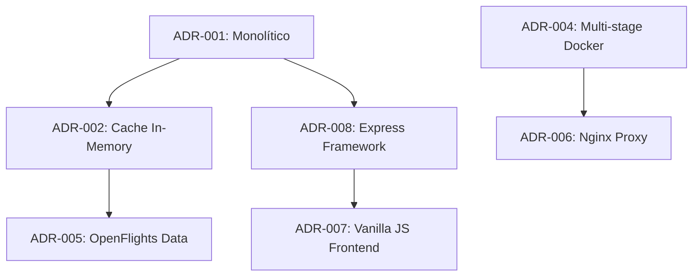

# Architecture Decision Records (ADRs)

## 📋 Índice de Decisões Arquiteturais

Este diretório contém todas as decisões arquiteturais importantes tomadas durante o desenvolvimento da AviationStack App. Cada ADR documenta o contexto, a decisão tomada, as alternativas consideradas e as consequências.

## 📚 Lista de ADRs

| ADR | Título | Status | Data |
|-----|--------|--------|------|
| [ADR-001](./adr-001-arquitetura-monolitica.md) | Arquitetura Monolítica vs Microserviços | ✅ Aceito | 2024-01-15 |
| [ADR-002](./adr-002-cache-in-memory.md) | Cache In-Memory com Fallback | ✅ Aceito | 2024-01-15 |
| [ADR-003](./adr-003-rate-limiting-automatico.md) | Rate Limiting Automático | ✅ Aceito | 2024-01-15 |
| [ADR-004](./adr-004-multi-stage-docker.md) | Multi-stage Docker Build | ✅ Aceito | 2024-01-15 |
| [ADR-005](./adr-005-openflights-data-source.md) | OpenFlights como Fonte de Dados | ✅ Aceito | 2024-01-15 |
| [ADR-006](./adr-006-nginx-reverse-proxy.md) | Nginx como Reverse Proxy | ✅ Aceito | 2024-01-15 |
| [ADR-007](./adr-007-vanilla-js-frontend.md) | Vanilla JavaScript no Frontend | ✅ Aceito | 2024-01-15 |
| [ADR-008](./adr-008-express-framework.md) | Express.js como Framework Web | ✅ Aceito | 2024-01-15 |

## 📝 Template ADR

Para criar novos ADRs, use o template abaixo:

```markdown
# ADR-XXX: [Título da Decisão]

## Status
**Status**: [Proposto | Aceito | Rejeitado | Deprecated | Substituído por ADR-XXX]  
**Data**: YYYY-MM-DD  
**Responsáveis**: [Nome(s)]

## Contexto
[Descreva a situação que levou à necessidade desta decisão arquitetural]

## Decisão
[Declare a decisão tomada e explique o raciocínio por trás dela]

## Alternativas Consideradas
[Liste as outras opções que foram consideradas e por que foram rejeitadas]

## Consequências

### Positivas
- ✅ [Lista de benefícios e vantagens]

### Negativas  
- ⚠️ [Lista de desvantagens e trade-offs]
- ❌ [Lista de riscos e limitações]

## Implementação
[Detalhes sobre como a decisão foi implementada, se aplicável]

## Notas
[Informações adicionais, links úteis, etc.]
```

## 🔄 Processo de ADR

### 1. Criação de ADR
1. **Identificar decisão**: Decisão arquitetural significativa precisa ser tomada
2. **Criar draft**: Usar template ADR com status "Proposto"
3. **Discussão**: Review da equipe e stakeholders
4. **Decisão**: Aprovar, rejeitar ou solicitar mudanças
5. **Documentar**: Atualizar status para "Aceito" ou "Rejeitado"

### 2. Manutenção de ADRs
- **Revisão regular**: ADRs devem ser revisados periodicamente
- **Atualização**: Quando decisões são alteradas, criar novo ADR
- **Deprecação**: Marcar ADRs obsoletos como "Deprecated"
- **Linkagem**: Referenciar ADRs relacionados

### 3. Versionamento
- **Numeração sequencial**: ADR-001, ADR-002, etc.
- **Não reutilizar números**: Mesmo para ADRs rejeitados
- **Manter histórico**: Todos os ADRs ficam no repositório

## 🎯 Tipos de Decisões Documentadas

### Decisões Estruturais
- Escolha de arquitetura (monolítica vs microserviços)
- Patterns arquiteturais (layered, clean architecture, etc.)
- Estrutura de módulos e componentes

### Decisões Tecnológicas
- Escolha de frameworks e bibliotecas
- Linguagens de programação
- Bancos de dados e sistemas de cache

### Decisões de Infrastructure
- Estratégias de deployment
- Configuração de containers
- Networking e security

### Decisões de Integração
- APIs externas e protocolos
- Formatos de dados
- Estratégias de fallback

## 📊 Impacto das Decisões

### Mapeamento Decisão → Impacto

| ADR | Área Impactada | Impacto na Performance | Impacto na Manutenção | Impacto na Escalabilidade |
|-----|----------------|----------------------|----------------------|---------------------------|
| **ADR-001** | Arquitetura | ✅ Alta | ✅ Simples | ⚠️ Limitada |
| **ADR-002** | Cache | ✅ Muito Alta | ✅ Simples | ⚠️ Memória limitada |
| **ADR-003** | API Integration | ⚠️ Latência adicional | ✅ Automático | ✅ Confiável |
| **ADR-004** | Deploy | ✅ Otimizada | ✅ Simples | ✅ Escalável |
| **ADR-005** | Data Source | ✅ Rápida | ✅ Baixa manutenção | ✅ Independente |
| **ADR-006** | Infrastructure | ✅ Load balancing | ⚠️ Complexidade | ✅ Horizontal scaling |
| **ADR-007** | Frontend | ✅ Leve | ⚠️ Manual | ⚠️ Limitada |
| **ADR-008** | Framework | ✅ Rápida | ✅ Familiar | ✅ Madura |

## 🔍 Padrões de Revisão

### Critérios para Review
1. **Clareza**: A decisão está claramente explicada?
2. **Contexto**: O problema está bem definido?
3. **Alternativas**: Outras opções foram consideradas?
4. **Consequências**: Trade-offs estão documentados?
5. **Implementação**: Como será executada?

### Aprovação de ADRs
- **Autor**: Propõe e documenta a decisão
- **Reviewer**: Arquiteto ou tech lead revisa
- **Stakeholders**: Product owner e equipe comentam
- **Aprovação final**: Consensus ou decisão do tech lead

## 📈 Evolução das Decisões

### Tracking Changes
```markdown
## Histórico de Mudanças
- **2024-01-15**: ADR-001 criado e aceito
- **2024-01-20**: ADR-002 atualizado com novas métricas
- **2024-02-01**: ADR-003 marcado como deprecated
- **2024-02-01**: ADR-009 criado para substituir ADR-003
```

### Decision Dependencies


## 📋 ADR Dashboard

### Status Overview
- ✅ **Aceitos**: 8 ADRs ativos
- 🚫 **Rejeitados**: 0 ADRs
- ⏳ **Propostos**: 0 ADRs pendentes
- 📋 **Deprecated**: 0 ADRs obsoletos

### Próximas Decisões Identificadas
- **Authentication Strategy**: Como implementar autenticação se necessário
- **Monitoring & Logging**: Escolha de ferramentas de observabilidade  
- **Error Handling**: Padronização de tratamento de erros
- **API Versioning**: Estratégia de versionamento da API REST
- **Database Integration**: Se e quando migrar para banco de dados

---
*Documentação gerada em: 2024-01-15*