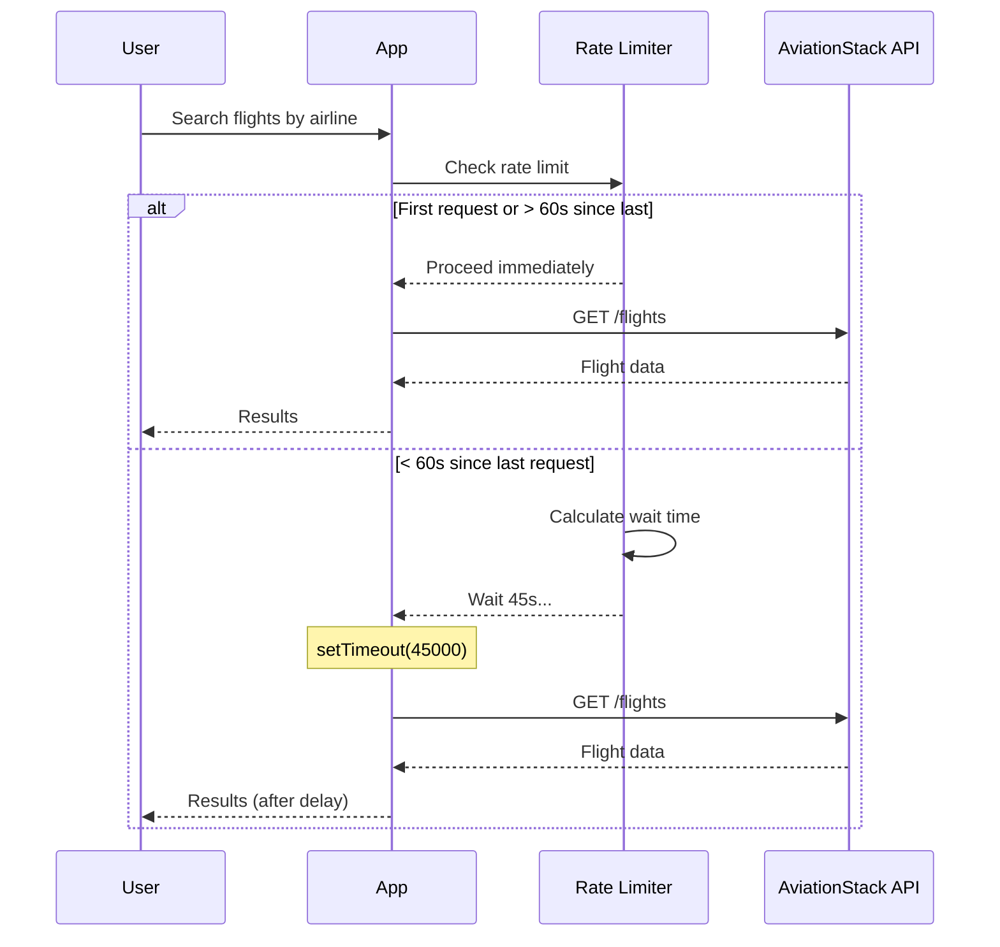

# ADR-003: Rate Limiting Automático

## Status
**Status**: ✅ Aceito  
**Data**: 2024-01-15  
**Responsáveis**: Equipe de Desenvolvimento  
**Relacionado**: ADR-002 (Cache Strategy)

## Contexto

A AviationStack API no plano gratuito impõe um limite rígido de **1 requisição por minuto** (60 requests por hora). Exceder este limite resulta em:
- HTTP 429 (Too Many Requests)
- Bloqueio temporário da API key
- Degradação da experiência do usuário

### Cenários Problemáticos
1. **Múltiplas consultas rápidas**: Usuário fazendo várias buscas
2. **Concurrent users**: Múltiplos usuários simultâneos
3. **Frontend polling**: Refresh automático de dados
4. **Development/testing**: Requests acidentais em desenvolvimento

### Requisitos Identificados
- Evitar erros 429 da AviationStack API
- Manter funcionalidade mesmo com rate limits
- Experiência de usuário consistente
- Transparência sobre waiting times

## Decisão

**Implementar rate limiting automático no cliente AviationStack** com queue de requisições e waiting inteligente.

### Implementação Escolhida
```javascript
// aviationstack.js:10-11, 19-27 - Rate limiting configuration
class AviationStackAPI {
  constructor() {
    this.lastRequestTime = 0;
    this.rateLimitDelay = 60000;  // 1 minuto em milliseconds
  }
  
  async makeRequest(endpoint, params = {}) {
    // Rate limiting check
    const now = Date.now();
    const timeSinceLastRequest = now - this.lastRequestTime;
    
    if (timeSinceLastRequest < this.rateLimitDelay && this.lastRequestTime > 0) {
      const waitTime = this.rateLimitDelay - timeSinceLastRequest;
      console.log(`Aguardando ${Math.ceil(waitTime / 1000)}s devido ao rate limit...`);
      await new Promise(resolve => setTimeout(resolve, waitTime));
    }
    
    this.lastRequestTime = Date.now();
    // Procede com a requisição...
  }
}
```

## Alternativas Consideradas

### Opção 1: Request Queue com Processing Background (Rejeitada)
```javascript
// Queue-based approach
class QueuedAPIClient {
  constructor() {
    this.requestQueue = [];
    this.isProcessing = false;
    this.startQueueProcessor();
  }
  
  async request(endpoint, params) {
    return new Promise((resolve, reject) => {
      this.requestQueue.push({ endpoint, params, resolve, reject });
    });
  }
  
  async processQueue() {
    while (this.requestQueue.length > 0) {
      const request = this.requestQueue.shift();
      await this.executeRequest(request);
      await this.wait(60000);
    }
  }
}
```

**Por que rejeitada**:
- ❌ **Complexity**: Gerenciamento de queue adiciona complexidade
- ❌ **Memory**: Queue pode crescer indefinidamente
- ❌ **User feedback**: Difficult to provide feedback sobre position in queue
- ❌ **Error handling**: Complexo gerenciar errors de requests enfileiradas

### Opção 2: Client-side Rate Limiting (Rejeitada)
```javascript
// Frontend managing rate limits
class FrontendRateLimit {
  constructor() {
    this.lastRequest = localStorage.getItem('lastAPIRequest');
  }
  
  async makeRequest() {
    const timeSince = Date.now() - this.lastRequest;
    if (timeSince < 60000) {
      throw new Error('Rate limit exceeded');
    }
  }
}
```

**Por que rejeitada**:
- ❌ **Multiple clients**: Não funciona com múltiplos usuários
- ❌ **Browser sync**: localStorage não é compartilhado
- ❌ **Server responsibility**: Rate limiting deve ser server-side

### Opção 3: Ignore Rate Limits (Rejeitada)
```javascript
// No rate limiting, handle 429 errors
async makeRequest() {
  try {
    return await axios.get(url);
  } catch (error) {
    if (error.response.status === 429) {
      throw new Error('Rate limit exceeded, try again later');
    }
  }
}
```

**Por que rejeitada**:
- ❌ **Poor UX**: Errors inesperados para usuários
- ❌ **API key blocking**: Risk de bloqueio da chave
- ❌ **Unpredictable**: Comportamento inconsistente

### Opção 4: Premium API Plan (Rejeitada)
**Por que rejeitada**:
- ❌ **Cost**: $59/month para 10,000 requests
- ❌ **Overkill**: Volume esperado é baixo
- ❌ **Learning project**: Objetivo é demonstrar técnicas de otimização

## Consequências

### Positivas ✅

#### Reliability
- **Zero 429 errors**: API nunca é excedida
- **Predictable behavior**: Usuários sabem o que esperar
- **API key protection**: Evita bloqueio da chave de API
- **Graceful degradation**: Sistema continua funcionando

#### User Experience
- **Transparent waiting**: Usuário vê feedback sobre wait time
- **Eventually consistent**: Dados chegam, apenas com delay
- **No surprises**: Comportamento consistente e previsível

#### Development
- **No retry logic**: Simples implementation sem backoff complexo
- **Clear logging**: Logs informativos sobre rate limiting
- **Testable**: Comportamento determinístico

#### Cost
- **Free tier usage**: Mantém uso dentro do plano gratuito
- **No additional infrastructure**: Sem ferramentas externas de rate limiting

### Negativas ⚠️

#### Performance
- **Request latency**: Delay artificial de até 60 segundos
- **Sequential processing**: Apenas 1 request por minuto
- **User waiting**: UX degradada para queries consecutivas
- **Startup time**: Primeira requisição pode ser lenta

#### Scalability
- **Single instance**: Rate limiting não funciona com múltiplas instâncias
- **Global bottleneck**: Todas as requisições competem pelo mesmo rate limit
- **Concurrent users**: Múltiplos usuários compartilham o mesmo limite

#### Business Impact
- **Reduced throughput**: Limitação artificial de funcionalidade
- **User frustration**: Waiting times podem frustrar usuários
- **Feature limitations**: Algumas funcionalidades ficam impractical

## Implementação Detalhada

### Core Rate Limiting Logic
```javascript
// aviationstack.js:19-27 - Implementação do rate limiting
const now = Date.now();
const timeSinceLastRequest = now - this.lastRequestTime;

if (timeSinceLastRequest < this.rateLimitDelay && this.lastRequestTime > 0) {
  const waitTime = this.rateLimitDelay - timeSinceLastRequest;
  console.log(`Aguardando ${Math.ceil(waitTime / 1000)}s devido ao rate limit...`);
  await new Promise(resolve => setTimeout(resolve, waitTime));
}

this.lastRequestTime = Date.now();
```

### State Management
```javascript
// Estado do rate limiter (aviationstack.js:10-11)
this.lastRequestTime = 0;        // Timestamp da última requisição
this.rateLimitDelay = 60000;     // Delay fixo de 1 minuto
```

### User Feedback
```javascript
// Logging para feedback ao usuário
console.log(`Aguardando ${Math.ceil(waitTime / 1000)}s devido ao rate limit...`);

// Frontend pode mostrar:
// "Aguardando 45s devido ao limite da API..."
```

### Request Flow


## Monitoramento e Métricas

### Métricas Implementadas
```javascript
// Logs de rate limiting (aviationstack.js:25)
console.log(`Aguardando ${Math.ceil(waitTime / 1000)}s devido ao rate limit...`);

// Request logging (aviationstack.js:36-37)
console.log(`🔄 Fazendo requisição para: ${url}`);
console.log(`📝 Parâmetros:`, requestParams);
```

### Métricas Recomendadas
```javascript
// Implementação futura sugerida:
class RateLimitMetrics {
  constructor() {
    this.stats = {
      total_requests: 0,
      rate_limited_requests: 0,
      total_wait_time: 0,
      avg_wait_time: 0
    };
  }
  
  recordWait(waitTime) {
    this.stats.rate_limited_requests++;
    this.stats.total_wait_time += waitTime;
    this.stats.avg_wait_time = this.stats.total_wait_time / this.stats.rate_limited_requests;
  }
}
```

## Validação da Decisão

### Testes de Validação

#### 1. Rate Limit Effectiveness
```bash
# Teste: Fazer múltiplas requisições rápidas
curl http://localhost:3000/api/flights/airline/AA
curl http://localhost:3000/api/flights/airline/DL  # Deve aguardar ~60s
```

#### 2. Cache Integration
```bash
# Teste: Verificar que cache não é afetado por rate limiting
curl http://localhost:3000/api/autocomplete/airports?q=gru  # Instantâneo
curl http://localhost:3000/api/autocomplete/airports?q=jfk  # Instantâneo
```

#### 3. Error Handling
```bash
# Teste: API key inválida
AVIATIONSTACK_API_KEY=invalid npm start
curl http://localhost:3000/api/flights  # Deve retornar erro claro
```

### Success Criteria ✅
- ✅ **Zero 429 errors**: Nenhum erro de rate limiting
- ✅ **Clear feedback**: Usuário sabe quando está esperando
- ✅ **Cache unaffected**: Autocomplete continua rápido
- ✅ **Predictable timing**: 60s entre requests externos

## Evolução e Melhorias Futuras

### Improvements Identificadas

#### 1. Smart Queueing
```javascript
// Implementação futura: Queue inteligente
class SmartRateLimit {
  constructor() {
    this.queue = [];
    this.isProcessing = false;
  }
  
  async request(endpoint, params, priority = 'normal') {
    // High priority requests jump queue
    if (priority === 'high') {
      this.queue.unshift({ endpoint, params });
    } else {
      this.queue.push({ endpoint, params });
    }
    
    return this.processNext();
  }
}
```

#### 2. Request Deduplication
```javascript
// Evitar requests duplicadas
class DeduplicatedRateLimit {
  constructor() {
    this.pendingRequests = new Map();
  }
  
  async request(endpoint, params) {
    const key = `${endpoint}:${JSON.stringify(params)}`;
    
    if (this.pendingRequests.has(key)) {
      return await this.pendingRequests.get(key);  // Reuse pending request
    }
    
    const promise = this.makeActualRequest(endpoint, params);
    this.pendingRequests.set(key, promise);
    
    try {
      const result = await promise;
      this.pendingRequests.delete(key);
      return result;
    } catch (error) {
      this.pendingRequests.delete(key);
      throw error;
    }
  }
}
```

#### 3. Multiple API Keys Rotation
```javascript
// Rotação entre múltiplas API keys
class MultiKeyRateLimit {
  constructor() {
    this.apiKeys = process.env.AVIATIONSTACK_API_KEYS.split(',');
    this.keyUsage = new Map();
  }
  
  getAvailableKey() {
    for (const key of this.apiKeys) {
      const lastUsed = this.keyUsage.get(key) || 0;
      if (Date.now() - lastUsed > 60000) {
        return key;
      }
    }
    return null;  // All keys rate limited
  }
}
```

## Related ADRs

- **ADR-002**: Cache strategy complementa rate limiting
- **ADR-005**: OpenFlights data source reduz necessidade de API calls
- **ADR-001**: Monolithic architecture simplifica rate limiting implementation

---
*ADR documentado em: 2024-01-15*