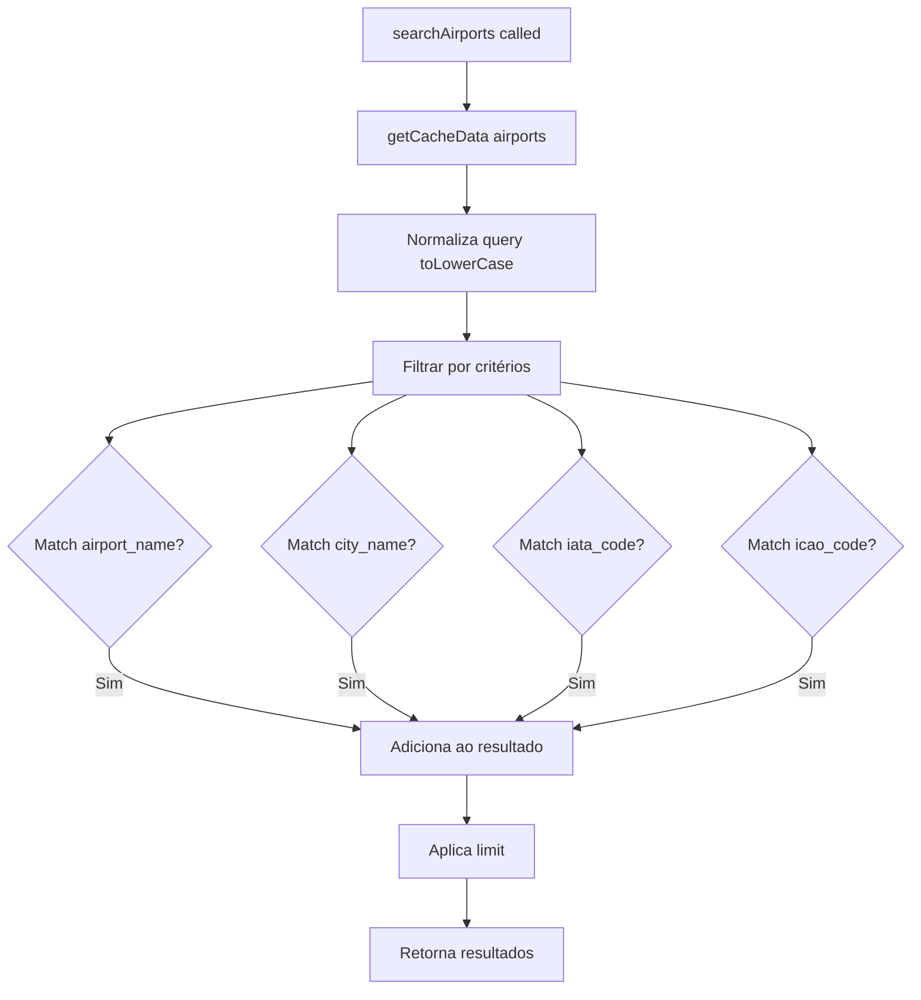
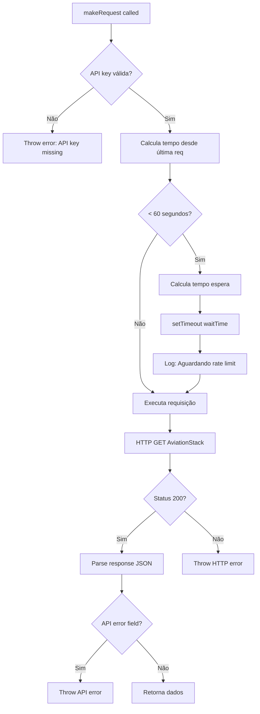
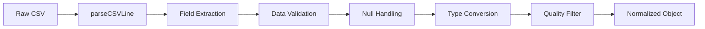
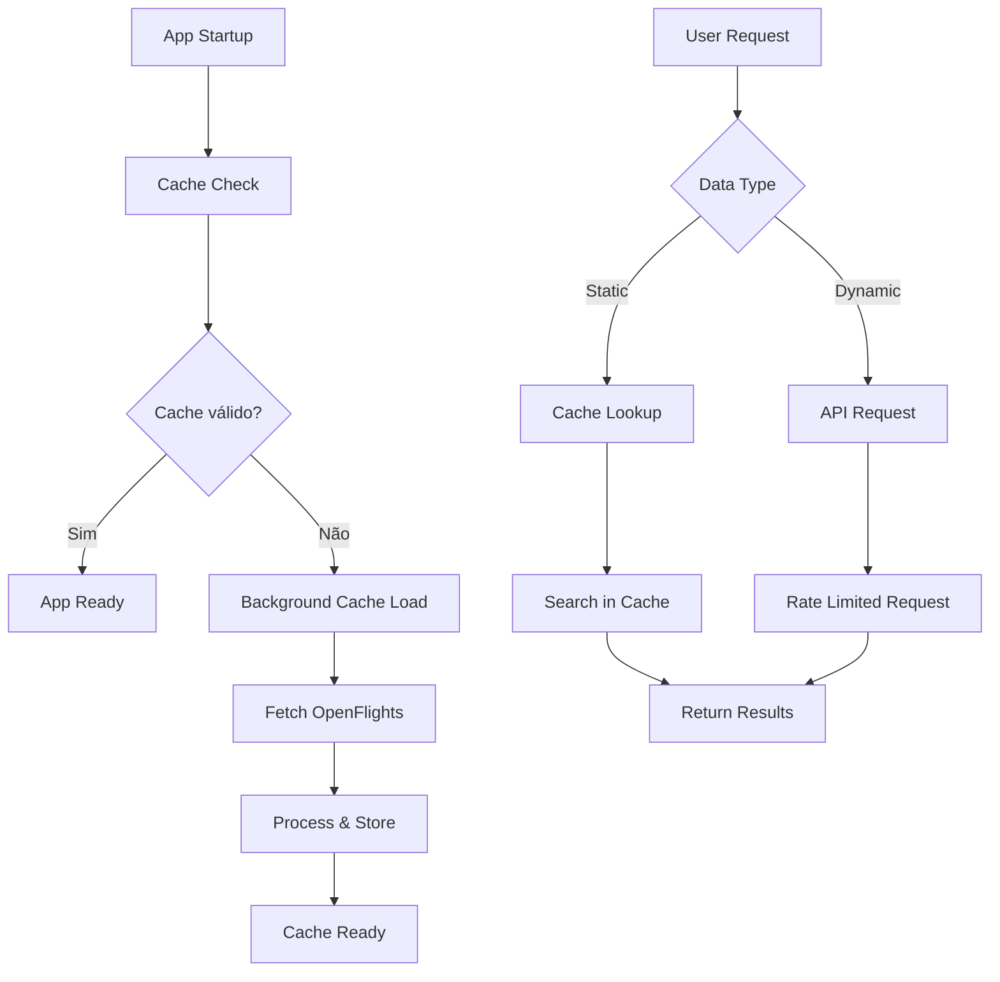
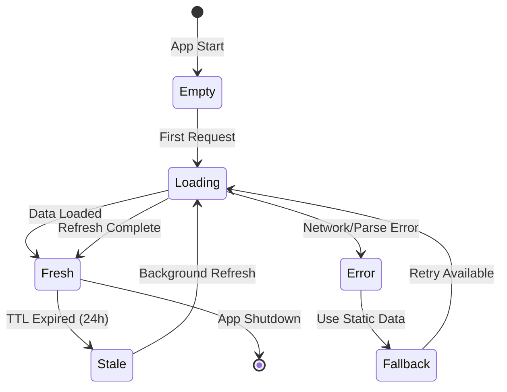

# Arquitetura de Dados

## 📊 Visão Geral da Arquitetura de Dados

A AviationStack App utiliza uma arquitetura híbrida de dados que combina consultas em tempo real via API externa com cache local inteligente para dados estáticos. A estratégia prioriza performance e disponibilidade através de múltiplas camadas de fallback.

## 🗂️ Fontes de Dados

### 1. AviationStack API (Dados Dinâmicos)
```
🌐 https://api.aviationstack.com/v1/
├── 🛩️ /flights     - Voos em tempo real
├── 🏢 /airlines    - Companhias aéreas ativas
├── 🏛️ /airports    - Dados de aeroportos
├── 🛤️ /routes      - Rotas de voos (pago)
└── ✈️ /aircraft    - Informações de aeronaves (pago)
```

**Características**:
- **Rate Limit**: 1 requisição/minuto (plano gratuito)
- **Dados**: Tempo real, atualizados constantemente
- **Formato**: JSON REST API
- **Autenticação**: API key via query parameter

### 2. OpenFlights Database (Dados Estáticos)
```
🌐 https://raw.githubusercontent.com/jpatokal/openflights/master/data/
├── 📄 airports.dat   - ~7,700 aeroportos mundiais
├── 📄 airlines.dat   - ~6,100 companhias aéreas
├── 📄 routes.dat     - ~67,000 rotas de voos
└── 📄 planes.dat     - ~246 tipos de aeronaves
```

**Características**:
- **Formato**: CSV com campos delimitados por vírgula
- **Atualização**: Mensal/trimestral (dados históricos estáveis)
- **Licença**: Open Data License
- **Performance**: Download único com cache local

### 3. Cache Local (Dados Otimizados)
```
🧠 Memory Cache (Map-based)
├── 💾 airports    - Lista processada de aeroportos
├── 🏢 airlines    - Lista processada de companhias
├── ⏰ TTL: 24h    - Time-to-live para invalidação
└── 🔍 Indexed     - Otimizado para busca rápida
```

## 📋 Modelos de Dados

### Aeroporto (Airport)
```javascript
// Estrutura normalizada - cache-manager.js:114-124
{
  iata_code: string,      // Código IATA (3 chars) - Chave primária
  icao_code: string?,     // Código ICAO (4 chars) - Opcional
  airport_name: string,   // Nome completo do aeroporto
  city_name: string,      // Cidade onde está localizado
  country_name: string,   // País
  timezone: string?,      // Fuso horário (IANA format)
  latitude: number?,      // Coordenada geográfica
  longitude: number?      // Coordenada geográfica
}

// Exemplo real:
{
  iata_code: "GRU",
  icao_code: "SBGR", 
  airport_name: "São Paulo-Guarulhos International Airport",
  city_name: "São Paulo",
  country_name: "Brazil",
  timezone: "America/Sao_Paulo",
  latitude: -23.432075,
  longitude: -46.469511
}
```

#### Mapeamento OpenFlights → Modelo Interno
```javascript
// cache-manager.js:110-124 - Transformação de dados
// OpenFlights CSV: ID,Name,City,Country,IATA,ICAO,Lat,Lon,Alt,TZ,DST,Tz,Type,Source
const fields = this.parseCSVLine(line);
{
  iata_code: fields[4],                    // Campo 4: IATA
  icao_code: fields[5] !== '\\N' ? fields[5] : null,  // Campo 5: ICAO
  airport_name: fields[1].replace(/"/g, ''),          // Campo 1: Nome
  city_name: fields[2].replace(/"/g, ''),             // Campo 2: Cidade  
  country_name: fields[3].replace(/"/g, ''),          // Campo 3: País
  timezone: fields[11] !== '\\N' ? fields[11] : null, // Campo 11: TZ
  latitude: parseFloat(fields[6]) || null,            // Campo 6: Lat
  longitude: parseFloat(fields[7]) || null             // Campo 7: Lon
}
```

### Companhia Aérea (Airline)
```javascript
// Estrutura normalizada - cache-manager.js:148-155
{
  iata_code: string,      // Código IATA (2-3 chars) - Chave primária
  icao_code: string?,     // Código ICAO (3-4 chars) - Opcional
  airline_name: string,   // Nome completo da companhia
  country_name: string,   // País de origem/registro
  callsign: string?       // Callsign para comunicação aérea
}

// Exemplo real:
{
  iata_code: "G3",
  icao_code: "GLO",
  airline_name: "GOL Linhas Aéreas",
  country_name: "Brazil",
  callsign: "GOL"
}
```

#### Mapeamento OpenFlights → Modelo Interno
```javascript
// cache-manager.js:144-155 - Transformação de dados
// OpenFlights CSV: ID,Name,Alias,IATA,ICAO,Callsign,Country,Active
const fields = this.parseCSVLine(line);
if (fields[7] === 'Y') {  // Apenas companhias ativas
  {
    iata_code: fields[3],                           // Campo 3: IATA
    icao_code: fields[4] !== '\\N' ? fields[4] : null, // Campo 4: ICAO
    airline_name: fields[1].replace(/"/g, ''),         // Campo 1: Nome
    country_name: fields[6].replace(/"/g, ''),         // Campo 6: País
    callsign: fields[5] !== '\\N' ? fields[5] : null   // Campo 5: Callsign
  }
}
```

### Voo (Flight) - AviationStack API
```javascript
// Estrutura da API AviationStack (apenas leitura)
{
  flight_date: "2024-01-15",
  flight_status: "active" | "scheduled" | "landed" | "cancelled" | "incident",
  departure: {
    airport: "GRU",
    timezone: "America/Sao_Paulo", 
    iata: "GRU",
    icao: "SBGR",
    terminal: "3",
    gate: "B12",
    delay: 15,                    // minutos
    scheduled: "2024-01-15T10:30:00+00:00",
    estimated: "2024-01-15T10:45:00+00:00",
    actual: "2024-01-15T10:47:00+00:00"
  },
  arrival: {
    airport: "JFK",
    timezone: "America/New_York",
    iata: "JFK", 
    icao: "KJFK",
    terminal: "4",
    gate: "A1",
    baggage: "12",
    delay: null,
    scheduled: "2024-01-15T18:45:00+00:00",
    estimated: "2024-01-15T18:45:00+00:00",
    actual: null
  },
  airline: {
    name: "American Airlines",
    iata: "AA",
    icao: "AAL"
  },
  flight: {
    number: "245",
    iata: "AA245", 
    icao: "AAL245",
    codeshared: null
  },
  aircraft: {
    registration: "N123AA",
    iata: "B77W",
    icao: "B77W", 
    icao24: "A12345"
  },
  live: {
    updated: "2024-01-15T15:30:00+00:00",
    latitude: 40.7589,
    longitude: -73.7789,
    altitude: 35000,
    direction: 45,
    speed_horizontal: 850,
    speed_vertical: 0,
    is_ground: false
  }
}
```

## 🔄 Fluxos de Dados Detalhados

### Fluxo 1: Cache Loading de Aeroportos
```mermaid
graph TD
    A[getAirports() called] --> B{Cache existe?}
    B -->|Não| C[Primeira execução]
    B -->|Sim| D{Cache válido?}
    
    D -->|Sim| E[Retorna cache]
    D -->|Não| F[Cache expirado]
    
    C --> G[HTTP GET OpenFlights]
    F --> G
    
    G --> H{Sucesso?}
    H -->|Sim| I[Parse CSV data]
    H -->|Não| J[Usa fallback estático]
    
    I --> K[Validação dados]
    K --> L[Filtra inválidos]
    L --> M[Armazena cache]
    
    J --> M
    M --> N[Retorna dados]
    E --> N
```

### Fluxo 2: Busca com Autocomplete


### Fluxo 3: Rate Limiting de API


## 🗄️ Estratégias de Cache

### Cache Configuration
```javascript
// cache-manager.js:4-8 - Configuração de cache
constructor() {
  this.cache = new Map();                    // Storage em memória
  this.TTL = 24 * 60 * 60 * 1000;          // 24 horas em milliseconds
  this.openFlightsBaseUrl = 'https://raw.githubusercontent.com/...';
}
```

### Cache Key Strategy
```javascript
// Chaves de cache utilizadas:
const CACHE_KEYS = {
  AIRPORTS: 'airports',          // Lista completa de aeroportos
  AIRLINES: 'airlines'           // Lista completa de companhias
};

// Estrutura de entrada no cache:
{
  'airports': {
    data: AirportData[],         // Array de aeroportos processados
    timestamp: 1642248000000     // Timestamp de criação
  }
}
```

### Cache Invalidation
```javascript
// cache-manager.js:10-16 - Verificação de expiração
isExpired(key) {
  const cached = this.cache.get(key);
  if (!cached) return true;       // Cache miss
  
  const now = Date.now();
  const age = now - cached.timestamp;
  return age > this.TTL;          // Expirou se > 24h
}
```

### Fallback Strategy
```javascript
// Hierarquia de fallback para dados críticos:
// 1. Memory Cache (primeiro)
// 2. OpenFlights CSV (segundo) 
// 3. Static Fallback (último)

// cache-manager.js:190-210 - Dados estáticos de emergência
async getFallbackAirports() {
  return [
    { iata_code: 'GRU', airport_name: 'Guarulhos International Airport', ... },
    { iata_code: 'SDU', airport_name: 'Santos Dumont', ... },
    { iata_code: 'CGH', airport_name: 'Congonhas', ... },
    // ... aeroportos críticos do Brasil
  ];
}
```

## 🔍 Processamento de Dados

### CSV Parsing (OpenFlights)
```javascript
// cache-manager.js:168-188 - Parser CSV robusto
parseCSVLine(line) {
  const result = [];
  let current = '';
  let inQuotes = false;
  
  // Processa caractere por caractere
  for (let i = 0; i < line.length; i++) {
    const char = line[i];
    
    if (char === '"') {
      inQuotes = !inQuotes;           // Toggle quote state
    } else if (char === ',' && !inQuotes) {
      result.push(current);           // Fim do campo
      current = '';
    } else {
      current += char;                // Adiciona ao campo atual
    }
  }
  
  result.push(current);               // Último campo
  return result;
}
```

### Data Validation e Filtering
```javascript
// cache-manager.js:131-136 - Filtros de qualidade
return airports.filter(airport => 
  airport.iata_code &&                    // IATA obrigatório
  airport.iata_code.length === 3 &&       // IATA deve ter 3 chars
  airport.airport_name                     // Nome obrigatório
);

// cache-manager.js:161-166 - Filtros para companhias
return airlines.filter(airline => 
  airline.iata_code && 
  airline.iata_code.length >= 2 &&        // IATA 2-3 chars
  airline.airline_name                     // Nome obrigatório
);
```

### Data Transformation Pipeline


## 🔍 Algoritmos de Busca

### Search Implementation (cache-manager.js:213-238)
```javascript
// Busca multi-campo case-insensitive
searchAirports(query, limit = 10) {
  const airports = this.getCacheData('airports') || [];
  const normalizedQuery = query.toLowerCase();
  
  return airports
    .filter(airport => 
      // Busca em múltiplos campos
      airport.airport_name?.toLowerCase().includes(normalizedQuery) ||
      airport.city_name?.toLowerCase().includes(normalizedQuery) ||
      airport.iata_code?.toLowerCase().includes(normalizedQuery) ||
      airport.icao_code?.toLowerCase().includes(normalizedQuery)
    )
    .slice(0, limit);  // Limitação de resultados
}
```

### Search Performance
```javascript
// Características de performance:
// - Complexidade: O(n) para busca linear
// - Otimização: toLowerCase() cacheable
// - Limit: Aplicado após filtro (slice)
// - Memory: ~7MB para ~7,700 aeroportos em cache

// Métricas típicas:
const SEARCH_METRICS = {
  airports_count: 7700,           // Itens pesquisáveis
  search_time: '<10ms',           // Tempo médio de busca
  memory_usage: '~7MB',           // Uso de memória
  cache_hit_ratio: '~95%'         // Taxa de acerto de cache
};
```

## 📈 Data Flow Architecture

### Arquitetura de Dados em Camadas
```
┌─────────────────────────────────────────┐
│  📱 Presentation Layer                   │
│  ├── REST API Endpoints                 │
│  └── JSON Response Formatting           │
├─────────────────────────────────────────┤
│  🧠 Business Logic Layer                │
│  ├── Search & Filter Logic              │
│  ├── Data Validation                    │
│  └── Error Handling                     │
├─────────────────────────────────────────┤
│  💾 Caching Layer                       │
│  ├── Memory Cache (Map)                 │
│  ├── TTL Management                     │
│  └── Cache-Aside Pattern                │
├─────────────────────────────────────────┤
│  🔌 Integration Layer                   │
│  ├── HTTP Client (Axios)                │
│  ├── Rate Limiting                      │
│  └── Request/Response Transformation    │
├─────────────────────────────────────────┤
│  🌐 External Data Sources               │
│  ├── AviationStack API (Real-time)      │
│  ├── OpenFlights DB (Static)            │
│  └── Fallback Data (Embedded)           │
└─────────────────────────────────────────┘
```

### Data Synchronization


## 📊 Estruturas de Dados em Memória

### Memory Cache Structure
```javascript
// Estrutura interna do Map cache:
Map {
  'airports' => {
    data: [
      { iata_code: 'GRU', airport_name: '...', ... },
      { iata_code: 'SDU', airport_name: '...', ... },
      // ... ~7,700 aeroportos
    ],
    timestamp: 1642248000000
  },
  'airlines' => {
    data: [
      { iata_code: 'G3', airline_name: 'GOL', ... },
      { iata_code: 'JJ', airline_name: 'TAM', ... },
      // ... ~6,100 companhias
    ],
    timestamp: 1642248000000
  }
}
```

### Memory Usage Estimation
```javascript
// Estimativa de uso de memória:
const MEMORY_USAGE = {
  airports: {
    count: 7700,
    size_per_record: '~200 bytes',
    total_size: '~1.5 MB'
  },
  airlines: {
    count: 6100, 
    size_per_record: '~150 bytes',
    total_size: '~0.9 MB'
  },
  overhead: {
    map_structure: '~0.1 MB',
    metadata: '~0.1 MB'
  },
  total_estimated: '~2.6 MB'
};
```

## 🔐 Data Security e Compliance

### Proteção de API Keys
```javascript
// aviationstack.js:9 - Configuração segura
this.apiKey = process.env.AVIATIONSTACK_API_KEY;

// Verificação obrigatória antes de requisições
if (!this.apiKey) {
  throw new Error('API key não configurada. Configure AVIATIONSTACK_API_KEY no arquivo .env');
}
```

### Data Sanitization
```javascript
// cache-manager.js - Limpeza de dados OpenFlights
airport_name: fields[1].replace(/"/g, ''),      // Remove quotes
city_name: fields[2].replace(/"/g, ''),         // Remove quotes  
country_name: fields[3].replace(/"/g, ''),      // Remove quotes

// Tratamento de valores nulos
icao_code: fields[5] !== '\\N' ? fields[5] : null,
timezone: fields[11] !== '\\N' ? fields[11] : null,
```

### Privacy Considerations
- **Dados Públicos**: Apenas informações públicas de aviação
- **Sem PII**: Nenhum dado pessoal coletado ou armazenado
- **Logs**: Apenas logs operacionais (sem dados sensíveis)
- **Cache**: Dados públicos em cache local (sem expiração de privacidade)

## 📊 Performance e Otimizações

### Cache Performance Metrics
```javascript
// Métricas de performance típicas:
const CACHE_PERFORMANCE = {
  hit_ratio: 0.95,              // 95% cache hit
  miss_penalty: '~2-5s',        // Tempo para carregar do OpenFlights  
  search_latency: '<10ms',      // Latência de busca no cache
  memory_footprint: '~3MB',     // Pegada de memória total
  cache_warmup: '~5-10s'        // Tempo para aquecimento inicial
};
```

### Data Loading Optimization
```javascript
// cache-manager.js:184-187 - Loading paralelo
const [airports, airlines] = await Promise.all([
  cacheManager.getAirports(),     // Carregamento paralelo
  cacheManager.getAirlines()      // para reduzir latência
]);
```

### Search Optimization
```javascript
// Otimizações implementadas:
// 1. Busca case-insensitive
const normalizedQuery = query.toLowerCase();

// 2. Multiple field search
airport.airport_name?.toLowerCase().includes(normalizedQuery) ||
airport.city_name?.toLowerCase().includes(normalizedQuery) ||
// ...

// 3. Early termination com slice
.slice(0, limit);

// 4. Null-safe operations
airport.airport_name?.toLowerCase()  // Optional chaining
```

## 🚀 Escalabilidade de Dados

### Limitações Atuais
- **Memory Cache**: Limitado pela RAM do container
- **Single Instance**: Cache não compartilhado entre instâncias
- **No Persistence**: Cache perdido em restart

### Estratégias de Escalabilidade

#### 1. Cache Distribuído (Redis)
```javascript
// Implementação futura recomendada:
class RedisCacheManager extends CacheManager {
  constructor() {
    super();
    this.redis = new Redis(process.env.REDIS_URL);
  }
  
  async setCacheData(key, data) {
    await this.redis.setex(key, this.TTL / 1000, JSON.stringify({
      data: data,
      timestamp: Date.now()
    }));
  }
  
  async getCacheData(key) {
    const cached = await this.redis.get(key);
    return cached ? JSON.parse(cached).data : null;
  }
}
```

#### 2. Database Integration
```javascript
// Para dados críticos de negócio:
class DatabaseManager {
  constructor() {
    this.db = new PostgreSQL(process.env.DATABASE_URL);
  }
  
  async getAirports(filters = {}) {
    const query = `
      SELECT iata_code, airport_name, city_name, country_name
      FROM airports 
      WHERE airport_name ILIKE $1
      LIMIT $2
    `;
    return await this.db.query(query, [`%${filters.search}%`, filters.limit]);
  }
}
```

#### 3. Data Partitioning
```javascript
// Estratégia de particionamento por região:
const REGIONAL_CACHE = {
  'americas': [],     // Aeroportos das Américas
  'europe': [],       // Aeroportos da Europa  
  'asia': [],         // Aeroportos da Ásia
  'oceania': []       // Aeroportos da Oceania
};
```

## 📋 Governança de Dados

### Data Quality Rules
```javascript
// Regras de qualidade implementadas:
const DATA_QUALITY_RULES = {
  airports: {
    required_fields: ['iata_code', 'airport_name'],
    iata_code: {
      length: 3,
      pattern: /^[A-Z]{3}$/
    },
    icao_code: {
      length: 4,
      pattern: /^[A-Z]{4}$/,
      optional: true
    }
  },
  airlines: {
    required_fields: ['iata_code', 'airline_name'],
    iata_code: {
      min_length: 2,
      max_length: 3,
      pattern: /^[A-Z0-9]{2,3}$/
    }
  }
};
```

### Data Lineage


### Update Strategy
```javascript
// Estratégia de atualização de dados:
const UPDATE_STRATEGY = {
  frequency: '24h',              // TTL do cache
  source_check: 'on_miss',       // Verifica fonte apenas em cache miss
  batch_size: 'full_dataset',    // Carrega dataset completo
  failure_mode: 'serve_stale'    // Serve dados antigos em caso de falha
};
```

## 📊 Data Analytics e Monitoring

### Logging de Dados
```javascript
// Logs implementados para rastreamento:
console.log(`✅ ${airports.length} aeroportos carregados e armazenados em cache`);
console.log(`✅ ${airlines.length} companhias carregadas e armazenadas em cache`);
console.log(`📋 Usando aeroportos do cache`);
console.log(`🔄 Carregando aeroportos do OpenFlights...`);
```

### Métricas de Uso
```javascript
// Métricas disponíveis via /api/cache/preload:
{
  message: 'Cache precarregado com sucesso',
  airports_count: 7700,
  airlines_count: 6100, 
  timestamp: '2024-01-15T10:30:00.000Z'
}
```

### Error Tracking
```javascript
// Tratamento de erros por categoria:
try {
  const data = await processData();
} catch (error) {
  if (error.code === 'NETWORK_ERROR') {
    // Log network issues
    console.error('❌ Erro de rede:', error.message);
  } else if (error.code === 'PARSE_ERROR') {
    // Log data parsing issues  
    console.error('❌ Erro de parsing:', error.message);
  } else {
    // Log generic errors
    console.error('❌ Erro genérico:', error.message);
  }
}
```

## 🔄 Data Lifecycle Management

### Cache Lifecycle


### Data Refresh Strategy
```javascript
// Estratégias de refresh implementadas:
const REFRESH_STRATEGIES = {
  lazy_loading: {
    trigger: 'on_demand',        // Apenas quando solicitado
    performance: 'high',         // Alta performance
    freshness: 'medium'          // Dados podem estar desatualizados
  },
  
  background_refresh: {
    trigger: 'scheduled',        // Timer-based refresh  
    performance: 'medium',       // Performance moderada
    freshness: 'high'           // Dados sempre atualizados
  },
  
  eager_loading: {
    trigger: 'startup',          // Carrega na inicialização
    performance: 'low_startup',  // Startup mais lento
    freshness: 'high'           // Dados sempre prontos
  }
};
```

## 📋 Data Migration e Versionamento

### Schema Evolution
```javascript
// Estratégia para evolução de schema de dados:
const SCHEMA_VERSIONS = {
  v1: {
    airports: ['iata_code', 'airport_name', 'city_name'],
    airlines: ['iata_code', 'airline_name']
  },
  v2: {  // Versão atual
    airports: ['iata_code', 'icao_code', 'airport_name', 'city_name', 'country_name', 'timezone', 'latitude', 'longitude'],
    airlines: ['iata_code', 'icao_code', 'airline_name', 'country_name', 'callsign']
  }
};
```

### Backward Compatibility
```javascript
// Estratégias para manter compatibilidade:
const COMPATIBILITY_LAYER = {
  field_mapping: {
    'old_field_name': 'new_field_name'
  },
  default_values: {
    'timezone': null,
    'coordinates': { lat: null, lon: null }
  },
  deprecation_warnings: {
    'v1_endpoints': 'Use v2 endpoints for better performance'
  }
};
```

## 🎯 Otimizações Futuras

### Recommended Improvements

#### 1. Indexação Avançada
```javascript
// Implementar índices para busca mais eficiente:
class IndexedCacheManager extends CacheManager {
  buildSearchIndex() {
    this.searchIndex = {
      by_iata: new Map(),        // Busca por código IATA
      by_name: new TrieTree(),   // Busca por prefixo de nome
      by_city: new Map(),        // Busca por cidade
      by_country: new Map()      // Busca por país
    };
  }
}
```

#### 2. Cache Estratificado
```javascript
// Múltiplas camadas de cache:
const CACHE_LAYERS = {
  L1: 'Memory (1GB)',          // Cache quente em memória
  L2: 'Redis (10GB)',          // Cache distribuído
  L3: 'File System (100GB)',   // Cache persistente
  L4: 'Database (∞)',          // Storage permanente
};
```

#### 3. Real-time Data Streaming
```javascript
// WebSocket para dados em tempo real:
class RealtimeDataManager {
  constructor() {
    this.websocket = new WebSocket('ws://api.aviationstack.com/live');
    this.subscribers = new Map();
  }
  
  subscribe(flightNumber, callback) {
    this.subscribers.set(flightNumber, callback);
  }
  
  onMessage(data) {
    const flight = JSON.parse(data);
    const callback = this.subscribers.get(flight.number);
    if (callback) callback(flight);
  }
}
```

---
*Documentação gerada em: 2024-01-15*