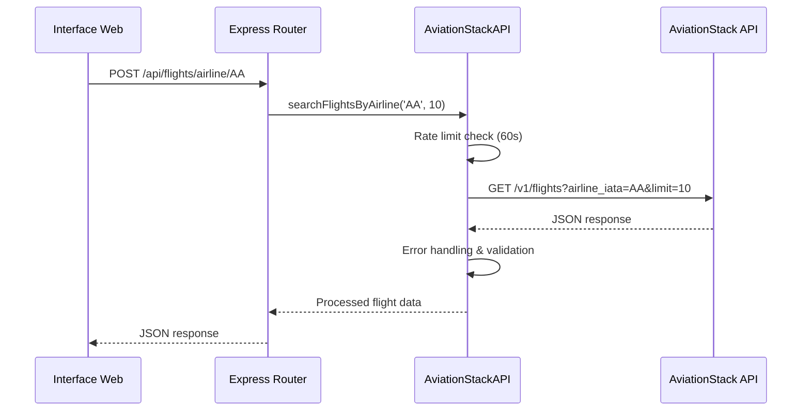
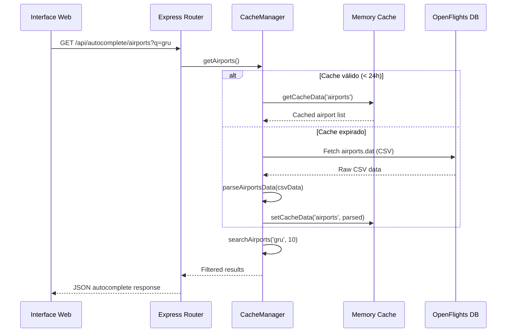

# Arquitetura de Componentes e Módulos

## 🧩 Visão Geral dos Componentes

A aplicação segue uma arquitetura modular simples com separação clara de responsabilidades, utilizando o padrão de módulos ES6 e classes para organização do código.

## 📁 Estrutura Modular Detalhada

```
📦 aviationstack-app/
├── 🎯 index.js                    # Aplicação Express principal
├── 🛩️ aviationstack.js            # Cliente API AviationStack
├── 💾 cache-manager.js            # Gerenciamento de cache
├── 🔨 build.js                    # Script de build
├── 🎨 public/                     # Assets frontend (desenvolvimento)
│   ├── 📄 index.html              # Interface principal
│   ├── 🎨 css/styles.css          # Estilos customizados
│   └── ⚡ js/
│       ├── 📱 app.js              # Lógica principal do frontend
│       └── 🔍 autocomplete.js     # Funcionalidade de busca
├── 📦 dist/                       # Assets otimizados (produção)
└── 🐳 docker/                     # Configurações de containerização
```

## 🎯 Componente Principal: Express Application

### index.js - Servidor Web Principal

#### Responsabilidades
- **Orquestração**: Inicialização e configuração da aplicação
- **Roteamento**: Definição de endpoints da API REST
- **Middlewares**: Configuração de compressão, CORS, parsing JSON
- **Static Serving**: Servir interface web e assets

#### Estrutura do Módulo
```javascript
// Dependências e configuração
import express from 'express';
import compression from 'compression';
import AviationStackAPI from './aviationstack.js';
import CacheManager from './cache-manager.js';

// Instanciação de serviços
const app = express();
const api = new AviationStackAPI();      // index.js:13
const cacheManager = new CacheManager(); // index.js:14
```

#### Endpoints da API

| Endpoint | Método | Handler | Linha | Responsabilidade |
|----------|--------|---------|-------|------------------|
| `/health` | GET | Health Check | 26-32 | Monitoramento de saúde |
| `/` | GET | Static HTML | 35-37 | Interface principal |
| `/api/flights` | GET | Real-time flights | 40-48 | Voos em tempo real |
| `/api/flights/airline/:code` | GET | Flights by airline | 50-59 | Voos por companhia |
| `/api/flights/route/:dep/:arr` | GET | Flights by route | 61-70 | Voos por rota |
| `/api/airports` | GET | Airports list | 72-80 | Lista de aeroportos |
| `/api/airports/:code` | GET | Airport by code | 82-90 | Aeroporto específico |
| `/api/airlines` | GET | Airlines list | 92-100 | Lista de companhias |
| `/api/autocomplete/airports` | GET | Airport search | 123-149 | Busca de aeroportos |
| `/api/autocomplete/airlines` | GET | Airline search | 151-177 | Busca de companhias |
| `/api/cache/preload` | GET | Cache preload | 180-199 | Precarregamento de cache |

#### Padrão de Error Handling
```javascript
// Padrão consistente em todos os endpoints
try {
  const data = await api.methodCall(params);
  res.json(data);
} catch (error) {
  res.status(500).json({ error: error.message });
}
```

## 🛩️ Cliente AviationStack API

### aviationstack.js - Integração com API Externa

#### Características da Classe
```javascript
class AviationStackAPI {
  constructor() {
    this.baseUrl = 'https://api.aviationstack.com/v1';  // aviationstack.js:8
    this.apiKey = process.env.AVIATIONSTACK_API_KEY;     // aviationstack.js:9
    this.lastRequestTime = 0;                            // aviationstack.js:10
    this.rateLimitDelay = 60000; // 1 minuto             // aviationstack.js:11
  }
}
```

#### Funcionalidades Principais

##### 1. Rate Limiting Automático (aviationstack.js:14-72)
```javascript
async makeRequest(endpoint, params = {}) {
  // Verificação de rate limit
  const timeSinceLastRequest = now - this.lastRequestTime;
  if (timeSinceLastRequest < this.rateLimitDelay) {
    const waitTime = this.rateLimitDelay - timeSinceLastRequest;
    await new Promise(resolve => setTimeout(resolve, waitTime));
  }
  
  // Execução da requisição
  this.lastRequestTime = Date.now();
  const response = await axios.get(url, { params: requestParams });
}
```

##### 2. Tratamento de Erros Robusto
```javascript
// Múltiplas camadas de tratamento de erro:
if (data.error) {                                    // Erros da API
  if (data.error.code === 'function_access_restricted') {
    throw new Error(`Função não disponível no plano gratuito`);
  }
}

if (error.response) {                                // Erros HTTP
  throw new Error(`Erro HTTP: ${error.response.status}`);
}
```

##### 3. Métodos Especializados
```javascript
// Métodos convenientes para diferentes tipos de consulta
async searchFlightsByAirline(airlineCode, limit = 10)    // aviationstack.js:94-99
async searchFlightsByRoute(departure, arrival, limit = 10) // aviationstack.js:101-107
async searchAirportByCode(code)                          // aviationstack.js:109-113
```

## 💾 Gerenciador de Cache

### cache-manager.js - Cache Inteligente

#### Arquitetura do Cache
```javascript
class CacheManager {
  constructor() {
    this.cache = new Map();                    // cache-manager.js:5
    this.TTL = 24 * 60 * 60 * 1000;          // 24 horas
    this.openFlightsBaseUrl = 'https://raw.githubusercontent.com/...'; // cache-manager.js:7
  }
}
```

#### Estratégias de Cache

##### 1. TTL (Time To Live) Management
```javascript
isExpired(key) {                              // cache-manager.js:10-16
  const cached = this.cache.get(key);
  if (!cached) return true;
  const now = Date.now();
  return (now - cached.timestamp) > this.TTL;
}
```

##### 2. Cache com Fallback Strategy
```javascript
async getAirports() {                         // cache-manager.js:30-66
  // 1. Verificar cache local
  if (!this.isExpired('airports')) {
    return this.getCacheData('airports');
  }
  
  // 2. Tentar OpenFlights (fonte primária)
  try {
    const response = await axios.get(`${this.openFlightsBaseUrl}/airports.dat`);
    const airports = this.parseAirportsData(response.data);
    this.setCacheData('airports', airports);
    return airports;
  } catch (error) {
    // 3. Fallback para dados estáticos
    const fallbackData = await this.getFallbackAirports();
    this.setCacheData('airports', fallbackData);
    return fallbackData;
  }
}
```

##### 3. Parser CSV Robusto
```javascript
parseCSVLine(line) {                          // cache-manager.js:168-188
  // Parser que lida com campos quoted e escapados
  const result = [];
  let current = '';
  let inQuotes = false;
  
  for (let char of line) {
    if (char === '"') inQuotes = !inQuotes;
    else if (char === ',' && !inQuotes) {
      result.push(current);
      current = '';
    } else current += char;
  }
  return result;
}
```

##### 4. Busca Inteligente
```javascript
searchAirports(query, limit = 10) {          // cache-manager.js:213-225
  const airports = this.getCacheData('airports') || [];
  const normalizedQuery = query.toLowerCase();
  
  return airports.filter(airport => 
    airport.airport_name?.toLowerCase().includes(normalizedQuery) ||
    airport.city_name?.toLowerCase().includes(normalizedQuery) ||
    airport.iata_code?.toLowerCase().includes(normalizedQuery) ||
    airport.icao_code?.toLowerCase().includes(normalizedQuery)
  ).slice(0, limit);
}
```

## 🎨 Componentes Frontend

### Interface Web (public/index.html:1-303)

#### Estrutura da Interface
```html
<!-- Cabeçalho com branding -->
<header class="text-center mb-12">            <!-- Linha 13-19 -->
  <h1>AviationStack API</h1>
  <p>Consulta de Voos em Tempo Real</p>
</header>

<!-- Navegação por abas -->
<nav class="mb-8">                            <!-- Linha 22-41 -->
  <button data-tab="flights">Voos</button>
  <button data-tab="airlines">Companhias</button>
  <button data-tab="airports">Aeroportos</button>
  <button data-tab="routes">Rotas</button>
</nav>

<!-- Seções de conteúdo -->
<main class="max-w-6xl mx-auto">              <!-- Linha 44-229 -->
  <section id="flights" class="tab-content active">
  <section id="airlines" class="tab-content">
  <section id="airports" class="tab-content">
  <section id="routes" class="tab-content">
</main>
```

#### Design System
- **Framework CSS**: Tailwind CSS (via CDN)
- **Icons**: Lucide Icons (via CDN)
- **Layout**: CSS Grid + Flexbox
- **Responsividade**: Mobile-first approach
- **Tema**: Gradient azul (from-blue-50 to-indigo-100)

### JavaScript Frontend (public/js/)

#### app.js - Lógica Principal
```javascript
// Estrutura esperada:
class FlightApp {
  constructor() {
    this.initializeEventListeners();
    this.setupTabNavigation();
  }
  
  async getAllFlights() { /* ... */ }
  async searchFlightsByAirline() { /* ... */ }
  async searchFlightsByRoute() { /* ... */ }
  async searchAirlines() { /* ... */ }
  async searchAirports() { /* ... */ }
}
```

#### autocomplete.js - Busca Inteligente
```javascript
// Funcionalidades de autocomplete para:
// - Busca de aeroportos por nome/código/cidade
// - Busca de companhias aéreas por nome/código
// - Debouncing para otimizar requests
// - Cache local no frontend
```

## 🔗 Padrões de Integração

### Padrão API Client
```javascript
// aviationstack.js implementa o padrão:
class APIClient {
  constructor(config) { /* configuração */ }
  async makeRequest(endpoint, params) { /* request base */ }
  async getResource(params) { /* método específico */ }
}
```

### Padrão Cache-Aside
```javascript
// cache-manager.js implementa:
async getData(key) {
  if (cache.has(key) && !isExpired(key)) {
    return cache.get(key);      // Cache hit
  }
  
  const data = await fetchFromSource();  // Cache miss
  cache.set(key, data);
  return data;
}
```

### Padrão Middleware Chain
```javascript
// index.js configuração de middlewares:
app.use(compression());           // Compressão gzip
app.use(express.json());          // Parser JSON
app.use(express.static(...));     // Arquivos estáticos
```

## 🎛️ Configuração e Environment

### Variables de Ambiente
```javascript
// Configurações suportadas:
process.env.AVIATIONSTACK_API_KEY  // Chave da API (obrigatória)
process.env.NODE_ENV               // Ambiente (development/production)
process.env.PORT                   // Porta do servidor (default: 3000)
```

### Build Configuration (build.js:1-86)
```javascript
// Script de build para produção:
const buildTasks = [
  minifyJS('./public/js/app.js', './dist/js/app.js'),
  minifyJS('./public/js/autocomplete.js', './dist/js/autocomplete.js'),
  minifyCSS('./public/css/styles.css', './dist/css/styles.css'),
  minifyHTML('./public/index.html', './dist/index.html')
];

await Promise.all(buildTasks);
```

## 🔄 Fluxos de Dados Entre Componentes

### Fluxo 1: Consulta de Voos em Tempo Real


### Fluxo 2: Autocomplete com Cache


## 📋 Interfaces e Contratos

### Interface AviationStackAPI
```typescript
// Métodos públicos da classe AviationStackAPI
interface AviationStackAPI {
  makeRequest(endpoint: string, params?: object): Promise<any>
  getRealTimeFlights(params?: object): Promise<FlightData[]>
  getAirports(params?: object): Promise<AirportData[]>
  getAirlines(params?: object): Promise<AirlineData[]>
  searchFlightsByAirline(code: string, limit?: number): Promise<FlightData[]>
  searchFlightsByRoute(dep: string, arr: string, limit?: number): Promise<FlightData[]>
  searchAirportByCode(code: string): Promise<AirportData[]>
}
```

### Interface CacheManager
```typescript
interface CacheManager {
  isExpired(key: string): boolean
  setCacheData(key: string, data: any): void
  getCacheData(key: string): any | null
  getAirports(): Promise<AirportData[]>
  getAirlines(): Promise<AirlineData[]>
  searchAirports(query: string, limit?: number): AirportData[]
  searchAirlines(query: string, limit?: number): AirlineData[]
}
```

### Interface REST API
```yaml
# Contratos da API REST
/api/flights:
  GET:
    parameters:
      - limit: number (1-100)
      - airline_iata: string (2-3 chars)
    responses:
      200: { data: FlightData[], pagination: {...} }
      500: { error: string }

/api/autocomplete/airports:
  GET:
    parameters:
      - q: string (min 1 char)
      - limit: number (default 10)
    responses:
      200: { data: AirportData[], count: number, query: string }
      500: { error: string }
```

## 🧪 Padrões de Testing

### Estratégias Recomendadas

#### 1. Unit Tests (Não implementado)
```javascript
// Testes recomendados para cada módulo:

// aviationstack.test.js
describe('AviationStackAPI', () => {
  test('should handle rate limiting correctly')
  test('should parse API errors properly')
  test('should format requests correctly')
})

// cache-manager.test.js  
describe('CacheManager', () => {
  test('should parse CSV data correctly')
  test('should handle cache expiration')
  test('should search airports accurately')
})
```

#### 2. Integration Tests
```javascript
// API endpoint tests
describe('API Endpoints', () => {
  test('GET /api/flights should return flight data')
  test('GET /api/autocomplete/airports should return filtered results')
  test('Health check should return valid status')
})
```

#### 3. E2E Tests
```javascript
// Frontend interaction tests
describe('Frontend Integration', () => {
  test('should search flights by airline code')
  test('should autocomplete airport names')
  test('should handle API errors gracefully')
})
```

## 🏗️ Padrões Arquiteturais Aplicados

### 1. Layered Architecture
```
┌─────────────────────────────────────┐
│  Presentation Layer (Express Routes) │
├─────────────────────────────────────┤
│  Business Logic (API Classes)       │  
├─────────────────────────────────────┤
│  Data Access (Cache + HTTP Client)  │
├─────────────────────────────────────┤
│  External Services (APIs)           │
└─────────────────────────────────────┘
```

### 2. Dependency Injection (Simples)
```javascript
// index.js - Injeção de dependências manual
const api = new AviationStackAPI();          // index.js:13
const cacheManager = new CacheManager();     // index.js:14

// Passagem para route handlers via closure
app.get('/api/flights', async (req, res) => {
  const data = await api.getRealTimeFlights(req.query); // index.js:43
});
```

### 3. Facade Pattern
```javascript
// AviationStackAPI atua como facade para a API externa
class AviationStackAPI {
  // Métodos simples que encapsulam complexidade da API
  async searchFlightsByAirline(code, limit) {
    return await this.getRealTimeFlights({
      airline_iata: code,
      limit: limit
    });
  }
}
```

### 4. Cache-Aside Pattern
```javascript
// CacheManager implementa cache-aside
async getData(key) {
  if (!this.isExpired(key)) {
    return this.getCacheData(key);     // Cache hit
  }
  
  const data = await this.fetchFromSource();  // Cache miss
  this.setCacheData(key, data);
  return data;
}
```

## 🔧 Configuração de Desenvolvimento

### Setup Local
```bash
# Dependências necessárias
npm install                    # Instalar dependências
cp .env.example .env          # Configurar environment
npm run dev                   # Executar em modo desenvolvimento
```

### Hot Reload Configuration
```javascript
// package.json:9 - Watch mode para desenvolvimento
"dev": "node --watch index.js"
```

### Build Process
```javascript
// build.js - Otimizações para produção
const minifyJS = async (input, output) => {
  const result = await Terser.minify(code, {
    compress: { drop_console: true },
    mangle: true
  });
};
```

## 🎯 Pontos de Extensão

### 1. Novos Provedores de Dados
```javascript
// Padrão para adicionar novos clientes API:
class NewAPIClient {
  constructor() { /* configuração */ }
  async makeRequest() { /* implementação específica */ }
}

// Integração no index.js:
const newApi = new NewAPIClient();
app.get('/api/new-endpoint', async (req, res) => {
  const data = await newApi.getData(req.query);
  res.json(data);
});
```

### 2. Cache Persistente
```javascript
// Extensão para Redis ou outro cache persistente:
class RedisCacheManager extends CacheManager {
  constructor(redisConfig) {
    super();
    this.redis = new Redis(redisConfig);
  }
  
  async getCacheData(key) {
    return await this.redis.get(key);
  }
}
```

### 3. Autenticação
```javascript
// Middleware de autenticação:
const authMiddleware = (req, res, next) => {
  const token = req.headers.authorization;
  if (!isValidToken(token)) {
    return res.status(401).json({ error: 'Unauthorized' });
  }
  next();
};

// Aplicação em rotas protegidas:
app.get('/api/protected', authMiddleware, handler);
```

## 📊 Métricas e Monitoramento

### Pontos de Instrumentação

#### 1. Request Metrics
```javascript
// Middleware para métricas (recomendado):
const metricsMiddleware = (req, res, next) => {
  const start = Date.now();
  res.on('finish', () => {
    const duration = Date.now() - start;
    console.log(`${req.method} ${req.path} - ${res.statusCode} - ${duration}ms`);
  });
  next();
};
```

#### 2. Cache Metrics
```javascript
// Métricas de cache no CacheManager:
getCacheStats() {
  return {
    airports_count: this.getCacheData('airports')?.length || 0,
    airlines_count: this.getCacheData('airlines')?.length || 0,
    cache_hits: this.stats.hits,
    cache_misses: this.stats.misses
  };
}
```

#### 3. API Metrics
```javascript
// Métricas de API no AviationStackAPI:
getAPIStats() {
  return {
    total_requests: this.stats.requests,
    rate_limit_waits: this.stats.waits,
    errors: this.stats.errors,
    last_request: this.lastRequestTime
  };
}
```

---
*Documentação gerada em: 2024-01-15*