# Diagramas de Arquitetura - AviationStack App

## 📊 Visão Geral dos Diagramas

Esta documentação contém todos os diagramas arquiteturais da AviationStack App, organizados por diferentes níveis de abstração e perspectivas. Os diagramas seguem a notação do modelo C4 (Context, Containers, Components, Code) e utilizam Mermaid para visualização.

## 🌍 Nível 1: Diagrama de Contexto do Sistema

### Context Diagram - Visão Stakeholder

```mermaid
C4Context
    title Diagrama de Contexto - AviationStack App

    Person(end_user, "Usuário Final", "Consulta informações de voos<br/>através da interface web")
    Person(api_consumer, "Consumidor da API", "Aplicações que integram<br/>via API REST")
    Person(developer, "Desenvolvedor", "Mantém e evolui<br/>a aplicação")
    
    System(aviationstack_app, "AviationStack App", "Sistema web para consulta<br/>de dados de aviação")
    
    System_Ext(aviationstack_api, "AviationStack API", "API comercial para dados<br/>de voos em tempo real")
    System_Ext(openflights_db, "OpenFlights Database", "Base de dados aberta<br/>de aeroportos e companhias")
    System_Ext(github_cdn, "GitHub CDN", "Hospedagem de dados<br/>OpenFlights via CDN")
    System_Ext(tailwind_cdn, "Tailwind CDN", "Framework CSS<br/>via CDN")

    Rel(end_user, aviationstack_app, "Acessa interface web", "HTTPS")
    Rel(api_consumer, aviationstack_app, "Consome API REST", "HTTP/JSON")
    Rel(developer, aviationstack_app, "Deploy e mantém", "Docker/Git")
    
    Rel(aviationstack_app, aviationstack_api, "Consulta voos", "HTTPS/REST<br/>1 req/min")
    Rel(aviationstack_app, github_cdn, "Download dados estáticos", "HTTPS/CSV<br/>1x/dia")
    Rel(openflights_db, github_cdn, "Hospeda dados", "Git Push")
    Rel(aviationstack_app, tailwind_cdn, "Carrega CSS framework", "HTTPS")
```


### Stakeholders e Interações

| Stakeholder | Necessidades | Interações | Frequência |
|-------------|--------------|------------|------------|
| **Usuário Final** | Interface responsiva, dados atualizados | Web browser → App | Contínua |
| **Consumidor API** | Endpoints confiáveis, documentação | HTTP requests → API | Sob demanda |
| **Desenvolvedor** | Deploy simples, debugging fácil | Git/Docker → Infra | Diária |
| **AviationStack** | Respeitar rate limits, uso adequado | App → API | 1x/minuto |
| **OpenFlights** | Attribution, uso responsável | App → GitHub CDN | 1x/dia |

## 🏗️ Nível 2: Diagrama de Containers

### Container Architecture - Deployment View

```mermaid
C4Container
    title Diagrama de Containers - AviationStack App

    Person(user, "Usuário")
    
    Container_Boundary(c1, "AviationStack Platform") {
        Container(nginx_proxy, "Nginx Proxy", "Nginx 1.25-alpine", "Reverse proxy, load balancing<br/>e serving de assets estáticos")
        Container(node_app, "Node.js Application", "Node.js 20 + Express", "API REST, business logic<br/>e integração com APIs externas")
        Container(memory_cache, "Memory Cache", "JavaScript Map", "Cache in-memory para<br/>dados estáticos (TTL: 24h)")
    }
    
    ContainerDb_Ext(aviationstack_api, "AviationStack API", "REST API", "Dados de voos em tempo real<br/>Rate limit: 1 req/min")
    ContainerDb_Ext(openflights_data, "OpenFlights Data", "CSV Files", "Aeroportos e companhias<br/>~14MB de dados públicos")
    ContainerDb_Ext(cdn_services, "CDN Services", "Static Assets", "Tailwind CSS, Lucide Icons")

    Rel(user, nginx_proxy, "HTTP requests", "Port 8080")
    Rel(nginx_proxy, node_app, "Proxy pass", "Port 3000")
    Rel(node_app, memory_cache, "Cache operations", "In-process")
    Rel(node_app, aviationstack_api, "Flight data requests", "HTTPS/REST")
    Rel(memory_cache, openflights_data, "Data refresh", "HTTPS/CSV")
    Rel(user, cdn_services, "Static resources", "HTTPS")
```


### Container Specifications

#### aviationstack-nginx
```yaml
Image: nginx:1.25-alpine
Memory: ~10MB
CPU: ~0.1 cores
Ports: 8080:80
Config: ./nginx/nginx.conf
Health: GET /health
Restart: unless-stopped
```

#### aviationstack-app  
```yaml
Image: node:20-alpine (custom)
Memory: ~80MB
CPU: ~0.2 cores
Ports: 3000 (internal)
Environment: NODE_ENV=production
Health: GET /health
Restart: unless-stopped
```

### Network Communication


## 🧩 Nível 3: Diagrama de Componentes

### Component Architecture - Code Organization


### Component Interactions Detail

#### Request Flow - Real-time Flight Data


#### Request Flow - Cached Data (Autocomplete)


## 🔧 Nível 4: Diagramas de Código

### Class Diagram - Core Classes
```mermaid
classDiagram
    class ExpressApp {
        +express: Express
        +port: number
        +api: AviationStackAPI
        +cacheManager: CacheManager
        +setupMiddlewares()
        +setupRoutes()
        +start()
    }

    class AviationStackAPI {
        -baseUrl: string
        -apiKey: string
        -lastRequestTime: number
        -rateLimitDelay: number
        +makeRequest(endpoint, params) Promise~any~
        +getRealTimeFlights(params) Promise~FlightData[]~
        +getAirports(params) Promise~AirportData[]~
        +getAirlines(params) Promise~AirlineData[]~
        +searchFlightsByAirline(code, limit) Promise~FlightData[]~
        +searchFlightsByRoute(dep, arr, limit) Promise~FlightData[]~
    }

    class CacheManager {
        -cache: Map
        -TTL: number
        -openFlightsBaseUrl: string
        +isExpired(key) boolean
        +setCacheData(key, data) void
        +getCacheData(key) any
        +getAirports() Promise~AirportData[]~
        +getAirlines() Promise~AirlineData[]~
        +searchAirports(query, limit) AirportData[]
        +searchAirlines(query, limit) AirlineData[]
        +parseCSVLine(line) string[]
        +parseAirportsData(csvData) AirportData[]
    }

    class BuildSystem {
        +minifyJS(input, output) Promise~void~
        +minifyCSS(input, output) Promise~void~
        +minifyHTML(input, output) Promise~void~
        +copyAssets() Promise~void~
        +build() Promise~void~
    }

    ExpressApp --> AviationStackAPI : uses
    ExpressApp --> CacheManager : uses
    ExpressApp --> BuildSystem : build-time
    CacheManager --> "Map~string,CacheEntry~" : stores
    AviationStackAPI --> "axios" : http-client
```

### Data Models


## 📊 Diagramas de Fluxo de Dados

### Data Flow Overview - Sistema Completo

```mermaid
graph TD
    subgraph "External Data Sources"
        AS[AviationStack API<br/>📊 Real-time flights]
        OF[OpenFlights CSV<br/>📋 Static airports/airlines]
    end
    
    subgraph "Application Layer"
        subgraph "Data Access"
            AC[Aviation Client<br/>🛩️ Rate limited requests]
            CM[Cache Manager<br/>💾 24h TTL cache]
        end
        
        subgraph "Business Logic"
            RH[Route Handlers<br/>🛤️ API endpoints]
            SS[Search Service<br/>🔍 Multi-field search]
        end
        
        subgraph "Presentation"
            API[REST API<br/>📡 JSON responses]
            WEB[Web Interface<br/>🌐 HTML/CSS/JS]
        end
    end
    
    subgraph "Users"
        U1[Web Users<br/>👥 Interactive queries]
        U2[API Consumers<br/>🔌 Programmatic access]
    end

    AS -->|Rate limited<br/>1 req/min| AC
    OF -->|Daily download<br/>CSV parsing| CM
    
    AC --> RH
    CM --> RH
    CM --> SS
    
    RH --> API
    SS --> API
    RH --> WEB
    
    API --> U2
    WEB --> U1
```


### Cache Data Flow - Detailed


### API Request Flow - Rate Limiting
```mermaid
graph TD
    A[API Request] --> B[Rate Limiter Check]
    B --> C{Last Request > 60s ago?}
    
    C -->|Yes| D[Execute Immediately]
    C -->|No| E[Calculate Wait Time]
    
    E --> F[Log Wait Message]
    F --> G[setTimeout(waitTime)]
    G --> H[Execute After Wait]
    
    D --> I[HTTP Request to AviationStack]
    H --> I
    
    I --> J{Response Status}
    J -->|200| K[Parse JSON Response]
    J -->|4xx/5xx| L[Handle HTTP Error]
    
    K --> M{API Error Field?}
    M -->|No| N[Return Data]
    M -->|Yes| O[Handle API Error]
    
    L --> P[Throw HTTP Exception]
    O --> Q[Throw API Exception]
    
    N --> R[Update Last Request Time]
    P --> S[Error Response]
    Q --> S
    R --> T[Success Response]
```

## 🐳 Diagramas de Infrastructure

### Docker Architecture - Multi-stage Build

```mermaid
graph TD
    subgraph "Build Pipeline"
        S1[Stage 1: dependencies<br/>📦 npm ci --only=production]
        S2[Stage 2: build<br/>🔨 npm ci + npm run build]
        S3[Stage 3: app<br/>🚀 Production runtime]
        S4[Stage 4: production<br/>🌐 Nginx + Node.js]
    end
    
    subgraph "Source Files"
        SRC[Source Code<br/>📁 *.js, *.html, *.css]
        PKG[package.json<br/>📋 Dependencies]
    end
    
    subgraph "Outputs"
        PROD[Production Image<br/>🐳 ~150MB]
        DEV[Development Image<br/>🛠️ ~200MB]
    end
    
    SRC --> S2
    PKG --> S1
    PKG --> S2
    
    S1 --> S3
    S2 --> S3
    S2 --> S4
    S1 --> S4
    
    S3 --> PROD
    S2 --> DEV
```


### Deployment Architecture - Docker Compose


## 🔄 Diagramas de Estado

### Application Lifecycle


### Cache State Machine


## 📱 Diagramas de Interface

### Frontend Component Structure
```mermaid
graph TD
    subgraph "HTML Structure"
        H[index.html<br/>📄 Main page structure]
        H --> NAV[Navigation Tabs<br/>🗂️ flights | airlines | airports | routes]
        H --> MAIN[Main Content<br/>📋 Tab-based sections]
        H --> FOOTER[API Info Footer<br/>ℹ️ Documentation]
    end
    
    subgraph "JavaScript Components"
        APP[app.js<br/>⚡ Main application logic]
        AUTO[autocomplete.js<br/>🔍 Search functionality]
        
        APP --> TAB[Tab Management]
        APP --> FORM[Form Handling]
        APP --> API_CALLS[API Communication]
        
        AUTO --> DEBOUNCE[Debounced Search]
        AUTO --> RESULTS[Results Rendering]
    end
    
    subgraph "Styling"
        TW[Tailwind CSS<br/>🎨 Via CDN]
        CUSTOM[styles.css<br/>✨ Custom styles]
    end
    
    subgraph "Icons & Assets"
        LUCIDE[Lucide Icons<br/>🎯 Via CDN]
    end
    
    H --> APP
    H --> AUTO
    H --> TW
    H --> CUSTOM
    H --> LUCIDE
```

### User Interaction Flow


## 🚀 Performance Flow Diagrams

### Request Performance - Hot Path


### Memory Usage Over Time


## 🔍 Monitoring Dashboards

### System Health Overview


### API Usage Breakdown
```mermaid
pie title Request Distribution
    "Cached Data (airports/airlines)" : 70
    "Real-time Flights" : 25
    "Health Checks" : 5
```

### Cache Performance
```mermaid
xychart-beta
    title "Cache Hit Ratio Over Time"
    x-axis ["Hour 1", "Hour 6", "Hour 12", "Hour 18", "Hour 24"]
    y-axis "Hit Ratio %" 0 --> 100
    line [60, 85, 95, 97, 95]
```

## 🎯 Diagramas de Deploy

### CI/CD Pipeline (Recomendado)
```mermaid
graph LR
    A[Git Push] --> B[GitHub Actions]
    B --> C[Build Multi-stage Image]
    C --> D[Run Tests]
    D --> E[Security Scan]
    E --> F[Push to Registry]
    F --> G[Deploy to Staging]
    G --> H[Integration Tests]
    H --> I[Deploy to Production]
    
    C --> C1[Stage 1: Dependencies]
    C --> C2[Stage 2: Build]
    C --> C3[Stage 3: App]
    C --> C4[Stage 4: Production]
    
    C1 --> D
    C2 --> D
    C3 --> D
    C4 --> D
```

### Kubernetes Deployment (k8s-deployment.yaml)
```mermaid
graph TD
    subgraph "Kubernetes Cluster"
        subgraph "Namespace: aviationstack"
            subgraph "Deployment"
                POD1[Pod 1<br/>aviationstack-app]
                POD2[Pod 2<br/>aviationstack-app]
            end
            
            SVC[Service<br/>Load Balancer]
            ING[Ingress<br/>External Access]
            
            subgraph "ConfigMaps"
                CM1[nginx-config]
                CM2[app-config]
            end
            
            subgraph "Secrets"
                SEC1[aviationstack-api-key]
            end
        end
    end
    
    EXT[External Traffic] --> ING
    ING --> SVC
    SVC --> POD1
    SVC --> POD2
    
    POD1 --> CM1
    POD1 --> CM2
    POD1 --> SEC1
    POD2 --> CM1
    POD2 --> CM2
    POD2 --> SEC1
```

## 🎨 Frontend Architecture Diagrams

### Component Hierarchy - Frontend
```mermaid
graph TD
    subgraph "Document Structure"
        HTML[index.html]
        
        HTML --> HEADER[Header Component<br/>🎯 Branding + Title]
        HTML --> NAV[Navigation Component<br/>🗂️ Tab System]
        HTML --> MAIN[Main Content<br/>📋 Tab Panels]
        HTML --> FOOTER[Footer Component<br/>ℹ️ API Documentation]
    end
    
    subgraph "JavaScript Modules"
        APP[app.js<br/>⚡ Core Logic]
        AUTO[autocomplete.js<br/>🔍 Search Logic]
        
        APP --> TAB_MGR[Tab Manager]
        APP --> FORM_MGR[Form Manager] 
        APP --> API_CLIENT[API Client]
        APP --> RESULT_RENDERER[Result Renderer]
        
        AUTO --> DEBOUNCER[Input Debouncer]
        AUTO --> SEARCHER[Search Handler]
        AUTO --> SUGGESTER[Suggestion Renderer]
    end
    
    subgraph "External Dependencies"
        TAILWIND[Tailwind CSS<br/>🎨 CDN]
        LUCIDE[Lucide Icons<br/>🎯 CDN]
    end
    
    HTML --> APP
    HTML --> AUTO
    HTML --> TAILWIND
    HTML --> LUCIDE
```

### User Journey Flow
```mermaid
journey
    title User Journey - Flight Search
    section Arrival
      Open App: 5: User
      Load Interface: 4: System
      Display Options: 5: User
    section Search Setup  
      Select Tab: 5: User
      Enter Airline Code: 4: User
      Autocomplete Suggestion: 5: System
    section Data Retrieval
      Submit Search: 5: User
      Rate Limit Check: 3: System
      Wait for API: 2: User
      Display Results: 5: User
    section Exploration
      View Flight Details: 5: User
      Search Another Route: 4: User
      Compare Airlines: 4: User
```

## 📊 Architecture Decision Flow

### Decision Impact Map
```mermaid
mindmap
  root((AviationStack App<br/>Architecture))
    
    Data Strategy
      OpenFlights Source
        Free & Comprehensive
        Static Fallback
        CSV Processing
      Memory Cache
        24h TTL
        Instant Search
        No External Deps
      Rate Limiting
        1 req/min compliance
        Automatic waiting
        User feedback
    
    Container Strategy
      Multi-stage Build
        Size Optimization
        Security Hardening
        Environment Separation
      Docker Compose
        Development Profile
        Production Profile
        Network Isolation
      Nginx Proxy
        Load Balancing
        Static Serving
        Health Monitoring
    
    Technology Choices
      Node.js + Express
        Rapid Development
        Rich Ecosystem
        Container Friendly
      Vanilla Frontend
        No Build Complexity
        CDN Dependencies
        Progressive Enhancement
      Alpine Linux
        Small Base Image
        Security Updates
        Performance
```

## 🎯 Future Architecture Evolution

### Microservices Migration Path
```mermaid
graph TD
    subgraph "Current: Monolith"
        M[Single Node.js App<br/>All components together]
    end
    
    subgraph "Phase 1: Service Extraction"
        API[API Gateway]
        CACHE[Cache Service]
        AVIATION[Aviation Service]
        WEB[Web Frontend]
        
        API --> CACHE
        API --> AVIATION
        API --> WEB
    end
    
    subgraph "Phase 2: Data Layer"
        REDIS[Redis Cache]
        POSTGRES[PostgreSQL]
        KAFKA[Event Streaming]
        
        CACHE --> REDIS
        AVIATION --> POSTGRES
        AVIATION --> KAFKA
    end
    
    subgraph "Phase 3: Cloud Native"
        K8S[Kubernetes]
        ISTIO[Service Mesh]
        MONITORING[Observability Stack]
        
        K8S --> ISTIO
        K8S --> MONITORING
    end
    
    M --> API
    API --> REDIS
    REDIS --> K8S
```

### Scalability Evolution
```mermaid
graph LR
    subgraph "Current Capacity"
        C1[Single Instance<br/>~100 concurrent users<br/>Memory cache only]
    end
    
    subgraph "Horizontal Scale"
        C2[Multiple Instances<br/>~1000 concurrent users<br/>Shared Redis cache]
    end
    
    subgraph "Distributed Scale"  
        C3[Microservices<br/>~10K concurrent users<br/>Database + Event streaming]
    end
    
    subgraph "Global Scale"
        C4[Multi-region<br/>~100K concurrent users<br/>CDN + Edge computing]
    end
    
    C1 -->|Load increases| C2
    C2 -->|Complexity increases| C3  
    C3 -->|Global users| C4
```

---
*Documentação gerada em: 2024-01-15*